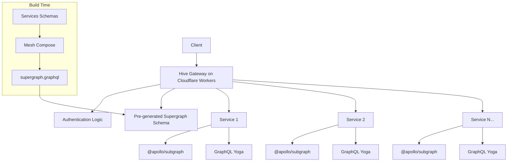

# Expense Microservices

## Project Architecture

This system implements a GraphQL gateway that connects two microservices built with Cloudflare Workers.

## Microservices

1. **User Microservice**:  
   Manages user information and accounts. This service also leverages in-memory cache and DataLoader for optimized data fetching.
2. **Expense Tracker Microservice**:  
   Tracks daily expenses linked to specific users. This service also leverages in-memory cache and DataLoader for optimized data fetching.

## Gateway Implementations

The gateway serves as a unified entry point for GraphQL operations, handling authentication, request routing, and resource management.

- **Implementation**:  
  Uses [Hive Gateway](https://the-guild.dev/graphql/hive) deployed on Cloudflare Workers with pre-compiled supergraph schema.

- **Key Features**:

  - Pre-compiled supergraph for unified schema representation
  - Service bindings for direct Cloudflare Worker-to-Worker communication
  - Proper resource management with runtime disposal
  - Cross-service query execution optimization

The gateway is designed with modularity in mind, separating concerns into distinct components:

- **Request Handling** : Manages the main request flow, CORS handling, and error responses
- **Gateway Initialization** : Configures and creates the gateway runtime
- **Authentication** : Handles user resolution and request validation
- **Service Routing** : Routes requests to appropriate backend services



## Tech Stack

- **Runtime**: Bun
- **GraphQL Server**: graphql-yoga
- **Workers**: Cloudflare Workers
- **Workspace Structure**:
  ```
  "workspaces": [
    "services/*",
    "gateway/*"
  ]
  ```

```
project-root/
├── gateway/
│   └── mesh-hive-gateway/
├── services/
│   ├── user-hub/
│   └── expense-tracker/
└── package.json
```

## Performance Optimization Strategies

- **In-Memory Caching**:  
  Both services implement a service-level in-memory cache to store frequently accessed data. This reduces redundant lookups and minimizes latency.
- **DataLoader Integration**:  
  DataLoader is used at the service level and in additional resolvers to batch and cache requests within a single GraphQL operation, further reducing the number of external calls.

## License

This project is licensed under the [MIT License](LICENSE).
