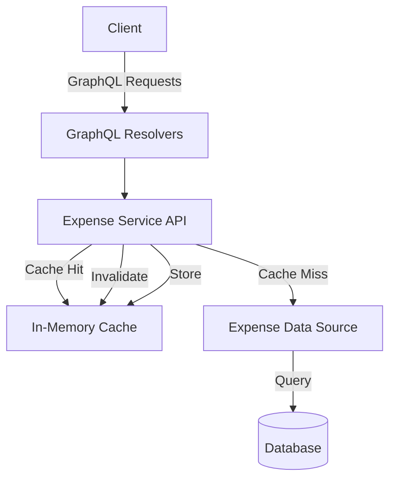
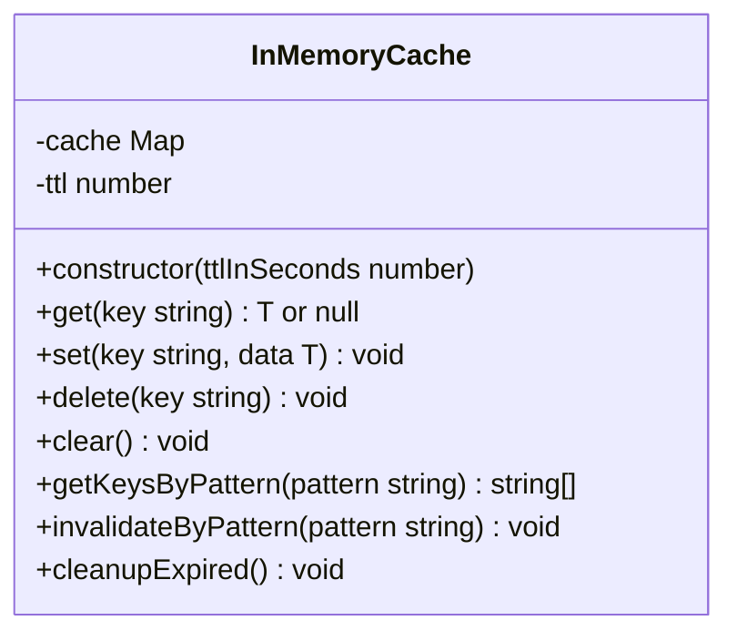
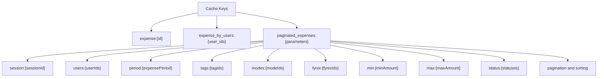
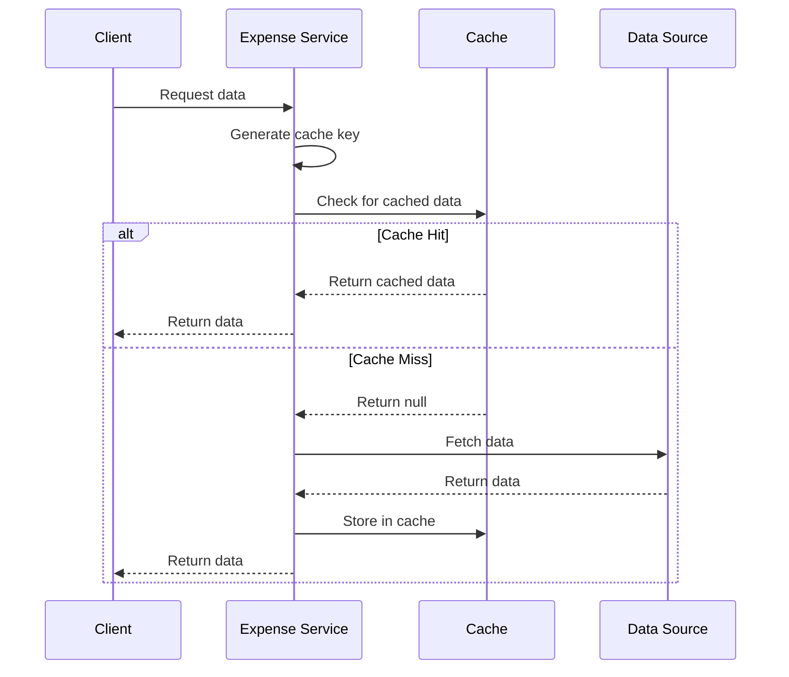
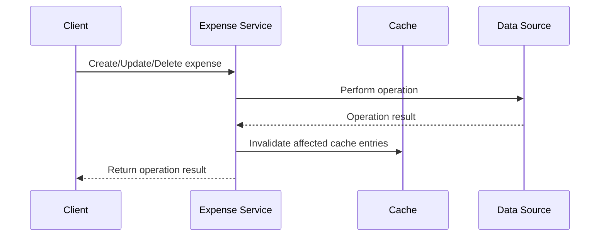
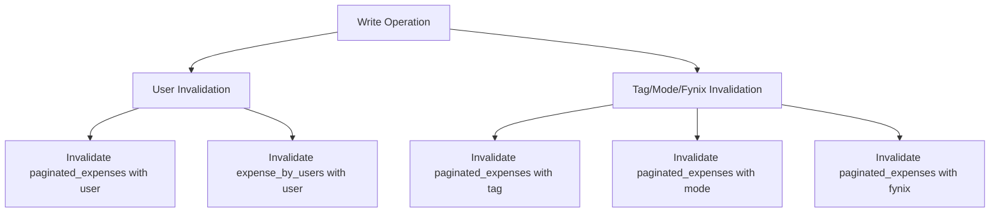

# Cache Implementation - Expense Service API - Documentation (Expense Tracker)

## Overview

The Expense Service API provides a complete solution for managing expense trackers within the application. It implements a caching strategy to improve performance and reduce database load. This document outlines the service architecture, caching mechanisms, and key operations.

## Architecture

## Cache Implementation

The Expense Service uses an in-memory caching system to optimize data access patterns, reduce database load, and improve response times.

### Cache Structure

The cache implementation is based on the `InMemoryCache` class that provides:

- Key-value storage with TTL (Time-To-Live)
- Pattern-based cache invalidation
- Automatic expiration of stale entries

### Cache Key Strategy

The service uses carefully constructed cache keys to ensure proper data isolation and efficient invalidation:

## Caching Flow

### Read Operations

### Write Operations

## Key Components

### Cache Invalidation Strategy

The service uses targeted invalidation strategies to maintain cache consistency:

## API Methods

### Read Operations

| Method                     | Description                                     | Cache Key                           |
| -------------------------- | ----------------------------------------------- | ----------------------------------- |
| `paginatedExpenseTrackers` | Retrieves paginated expense data with filtering | Complex key based on all parameters |
| `expenseTrackerByUserIds`  | Gets expenses for specific users                | `expense_by_users:{sortedUserIds}`  |
| `expenseTrackerById`       | Gets a single expense by ID                     | `expense:{id}`                      |

### Write Operations

| Method                 | Description                 | Cache Invalidation                                      |
| ---------------------- | --------------------------- | ------------------------------------------------------- |
| `createExpenseTracker` | Creates a new expense       | User-related caches                                     |
| `updateExpenseTracker` | Updates an existing expense | Specific expense and related user/tag/mode/fynix caches |
| `deleteExpenseTracker` | Deletes an expense          | Specific expense and related user/tag/mode/fynix caches |

## Performance Considerations

1. **Cache TTL**: The default TTL for expense cache entries is 15 minutes to balance freshness with performance.

2. **Pattern-based Invalidation**: Uses regex patterns to efficiently invalidate related cache entries when data changes.

3. **Parallel Operations**: The delete operation fetches expense data and performs deletion in parallel for improved performance.

## Best Practices

1. **Cache Key Consistency**: Always use the helper methods to generate cache keys to ensure consistency.

2. **Comprehensive Invalidation**: When modifying data, ensure all relevant caches are invalidated to prevent stale data.

3. **Error Handling**: All operations should include proper error handling to manage both database and cache failures.

## Future Improvements

1. **Cache Size Limits**: Add maximum size constraints to prevent unbounded memory growth.

2. **Cache Metrics**: Implement monitoring for cache hit/miss rates and performance statistics.

3. **Type Safety**: Enhance type definitions for improved type checking of cached values.
