# Expense Tracker Service Technical Design Document

## Overview

The Expense Tracker Service is a microservice in our architecture that provides expense tracking and categorization functionality through a GraphQL API. It's built as a Cloudflare Worker with D1 database integration and implements security mechanisms to ensure secure API access.

## Table of Contents

- [Technical Stack](#technical-stack)
- [Architecture Overview](#architecture-overview)
- [Development Setup](#development-setup)
- [API Endpoints](#api-endpoints)
- [Authentication & Security](#authentication--security)
- [Core Components](#core-components)
- [Request Flow](#request-flow)
- [Directory Structure](#directory-structure)
- [DB Structure](#db-structure)
- [Error Handling](#error-handling)
- [Testing](#testing)
- [Deployment and CI/CD](#deployment-and-cicd)
- [Conclusion](#conclusion)

## Technical Stack

- **Cloudflare Workers**: Serverless compute platform
- **Languages**: TypeScript, GraphQL
- **Frameworks**: NodeJS, GraphQL Yoga
- **D1 Database**: Cloudflare's SQL database
- **KV Namespace**: Cloudflare's KV namespaces (key-value database)
- **GraphQL (Yoga)**: API query language and runtime
- **Drizzle ORM**: Database toolkit for TypeScript
- **Upstash Redis**: Distributed Redis for auth token versioning and nonce tracking
- **Hosting**: Cloud-based hosting environment

### External Values

`user-id`

### Required Headers

- `X-Project-Token`, `X-Gateway-Nonce`, `X-Gateway-Signature`, `X-Gateway-Timestamp`, `X-User-Id`, `X-User-Role`, `X-User-Email`, `X-User-Name`

### Interfaces

- GraphQL Mesh with hive gateway interface

**Purpose:** Serve as primary interface to interact with expense tracker service.

- **API**: GraphQL
- **Protocols Used**: GraphQL over HTTPS
- **Other Interface**: Callable from other Cloudflare workers by service binding.

## Architecture Overview

### System Architecture

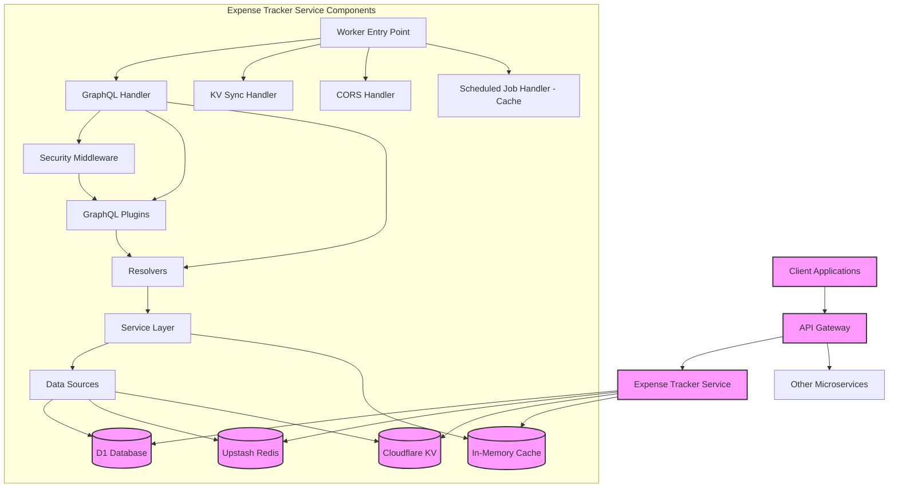

### Request Flow Diagram

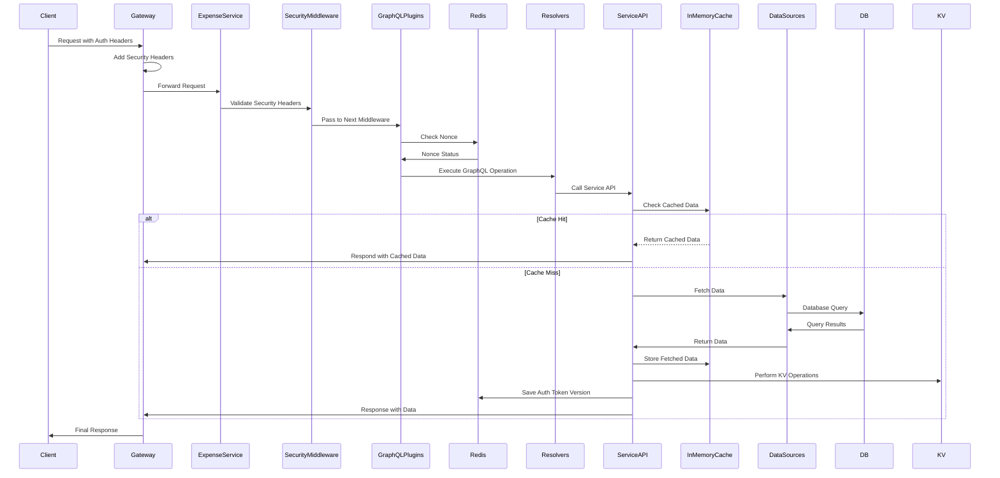

## Development Setup

### Prerequisites

- Wrangler CLI installed
- Access to Cloudflare account with appropriate permissions
- Node.js and npm/yarn/bun

### Installation

1. Clone the repository
2. Install dependencies: `bun install`
3. Set up environment variables (see below)

### Environment Variables

Required environment variables:

- `ENVIRONMENT`: Environment mode (DEV, STAGING, PROD)
- `PROJECT_TOKEN`: API access token
- `JWT_SECRET`: Secret for JWT operations
- `GATEWAY_SECRET`: Secret for gateway signature validation
- `GATEWAY_SIGNATURE`: Signature for schema federation
- `ALLOWED_ORIGINS`: Comma-separated list of allowed CORS origins
- `NONCE_ENABLED`: Enable/disable nonce validation ("true"/"false")
- `KV_SYNC_TOKEN`: Token for KV sync operations

### Available Scripts

```json
"scripts": {
  "migrate": "./migrate.sh",
  "generate": "graphql-codegen",
  "migration-list": "wrangler d1 migrations list DB",
  "migration-apply-production": "wrangler d1 migrations apply DB --remote",
  "deploy:staging": "wrangler deploy --env staging",
  "bundle-size": "wrangler build && wrangler deploy --dry-run",
  "deploy": "wrangler deploy",
  "dev": "(kill -9 $(lsof -t -i:8502) || true) && wrangler dev --name expense-tracker --port 8502 --inspector-port 8302 --persist-to=.db-local",
  "test": "vitest",
  "cf-typegen": "wrangler types",
  "prod:secrets": "./wrangler-secrets.sh"
}
```

### Local Development Workflow

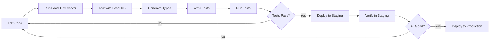

## API Endpoints

### GraphQL Endpoint: `/graphql`

The main interface for interacting with expense data. Provides queries and mutations for expense tracking and category management operations.

#### Example GraphQL Operations

```graphql
# Query expense categories
query ExpenseTags {
  expenseTags {
    id
    name
    created_at
    updated_at
    created_by
    updated_by
  }
}

# Create a new expense
mutation CreateExpense($input: CreateExpenseTrackerInput!) {
  createExpenseTracker(input: $input) {
    success
    expenseTracker {
      id
      user_id
      expense_period
      amount
      description
      item_details
      status
      tag_id
      mode_id
      fynix_id
    }
  }
}
```

## Authentication & Security

The service implements several security mechanisms:

### Security Flow

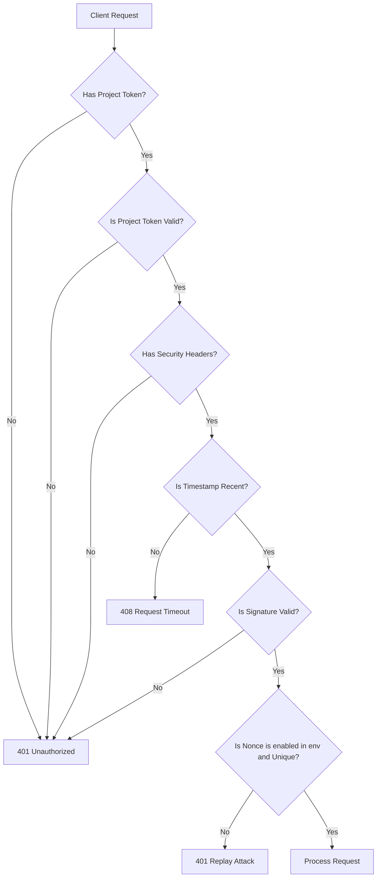

### 1. Project Token Validation

All requests must include a valid `X-Project-Token` header that matches the configured `PROJECT_TOKEN`.

### 2. Gateway Security Headers

The following headers are required for authenticated requests:

- `X-Gateway-Timestamp`: Current timestamp
- `X-Gateway-Nonce`: Unique request identifier
- `X-Gateway-Signature`: HMAC-SHA256 signature of payload
- `X-User-Id`, `X-User-Role`, `X-User-Email`, `X-User-Name`: User context headers

### 3. Nonce Validation

To prevent replay attacks, each nonce can only be used once within a 5-minute window.

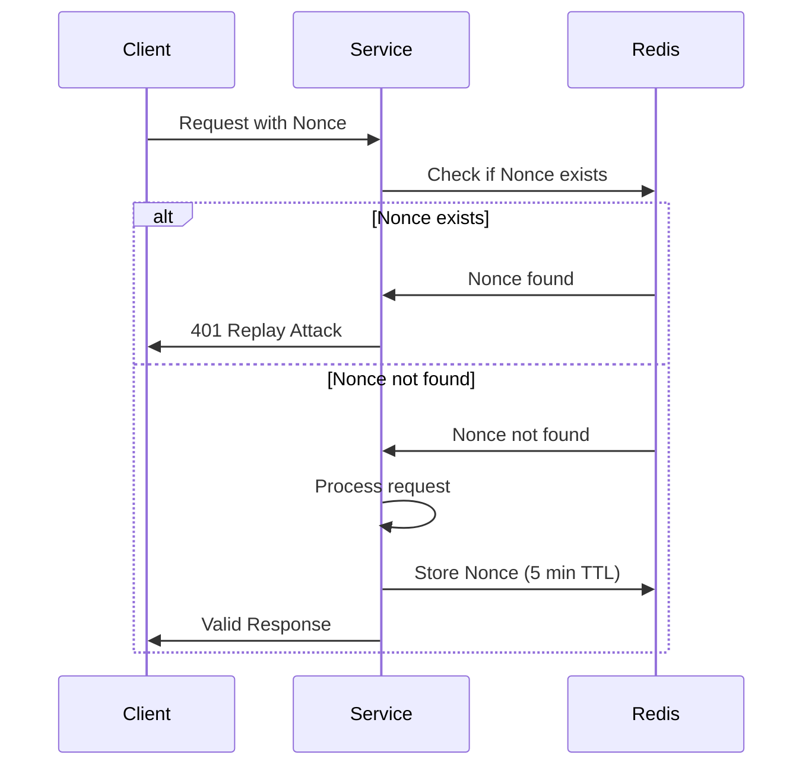

### 4. Session User

The service extracts user context from headers to create a session:

```typescript
type SessionUserType = {
  id: string;
  role: Role; // ADMIN or USER
  email: string;
  name: string;
};
```

### 5. CORS Protection

Implements strict CORS protection with origin validation against the `ALLOWED_ORIGINS` environment variable.

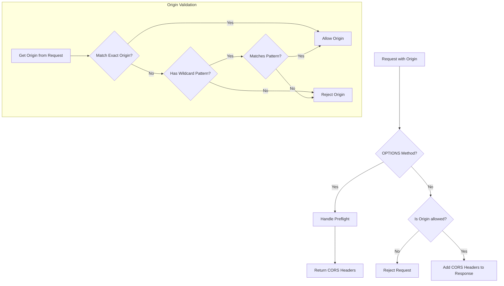

## Core Components

### Main Worker Handler

Entry point for all requests, routing to appropriate handlers based on URL paths.

```typescript
export default {
  async fetch(request: Request, env: Env): Promise<Response> {
    // Request routing logic
    // ...
  },
} as ExportedHandler<Env>;
```

### In-Memory Cache

We've implemented an in-memory caching mechanism to improve performance and reduce database load for frequently accessed expense data. The `InMemoryCache` class provides a flexible caching solution with the following key features:

- Configurable Time-to-Live (TTL)
- Automatic cache entry expiration
- Pattern-based key invalidation
- Thread-safe operations using JavaScript's `Map`

#### Cache Implementation Details

```typescript
export class InMemoryCache<T> {
  private readonly cache: Map<string, CacheEntry<T>>;
  private readonly ttl: number;

  constructor(ttlInSeconds = 300) {
    this.cache = new Map();
    this.ttl = ttlInSeconds * 1000; // Convert to milliseconds
  }

  // Methods: get, set, delete, clear,
  // getKeysByPattern, invalidateByPattern, cleanupExpired
}

// Dedicated cache instances for expense-related data
export const categoryCache = new InMemoryCache(15 * 60); // 15 minutes TTL
export const expenseCache = new InMemoryCache(10 * 60); // 10 minutes TTL
```

### Component Interaction

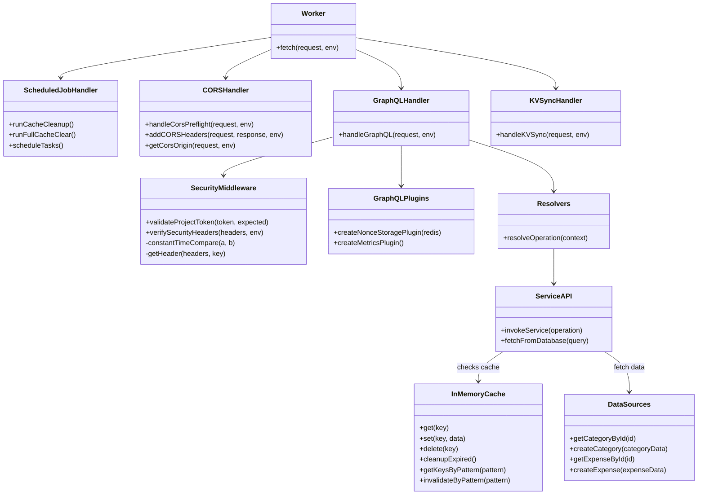

#### Caching Workflow

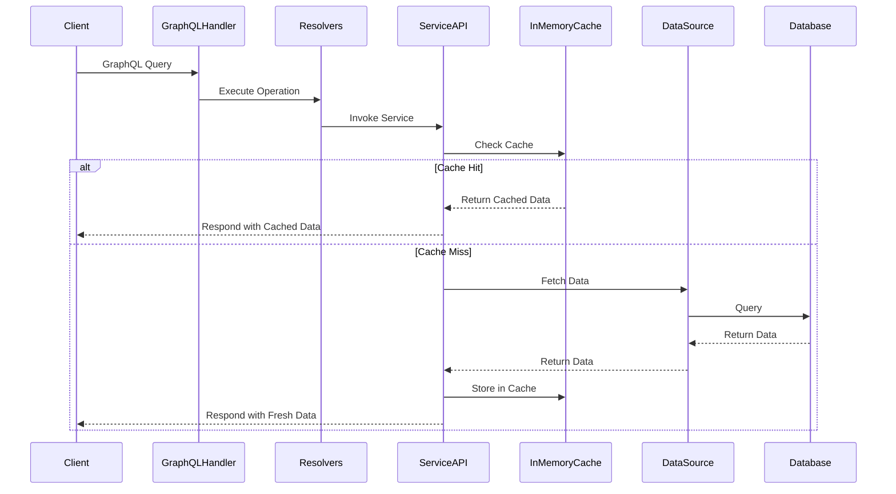

### Caching Strategy

- **Current Stage**: Using JavaScript's native `Map` for low-traffic scenarios
- **Traffic Handling**:
  - Low Traffic: In-memory cache with `Map`
  - High Traffic: Planned migration to distributed Redis cache

### Considerations and Future Improvements

1. **Performance Monitoring**: Implement cache hit/miss tracking
2. **Cache Invalidation**: Robust strategies for updating cached data
3. **Scalability**: Prepare for migration to distributed caching
4. **Memory Management**: Implement periodic cache cleanup

## Scheduled Jobs and Cache Management

### Cron Job Configuration

The Expense Tracker Service implements scheduled cache management jobs to ensure efficient memory usage and data freshness:

```json
"triggers": {
  "crons": [
    "0 */6 * * *",  // Cache cleanup - expired entries - every 6 hours
    "0 1 * * *"     // Full cache clear - daily at 1 AM
  ]
}
```

### Cache Cleanup Implementation

## Scheduled Job Handler

```typescript
async scheduled(controller: ScheduledController, env: Env, ctx: ExecutionContext) {
  switch (controller.cron) {
    case "0 */6 * * *":
      await runCacheCleanup(env, ctx);
      break;
    case "0 1 * * *":
      await runCleanCacheAll(env, ctx);
      break;
    default:
      console.error(`Unsupported cron schedule: ${controller.cron}`);
  }
}
```

### Cache Cleanup Strategy

#### Periodic Expired Entry Removal (Every 6 Hours)

- Removes entries that have exceeded their Time-to-Live (TTL)
- Helps prevent memory bloat
- Ensures cache contains only valid, recent data

#### Daily Full Cache Clear (1 AM Daily)

- Completely clears the cache
- Provides a comprehensive reset mechanism
- Useful for preventing potential long-term memory accumulation

### Caching Considerations

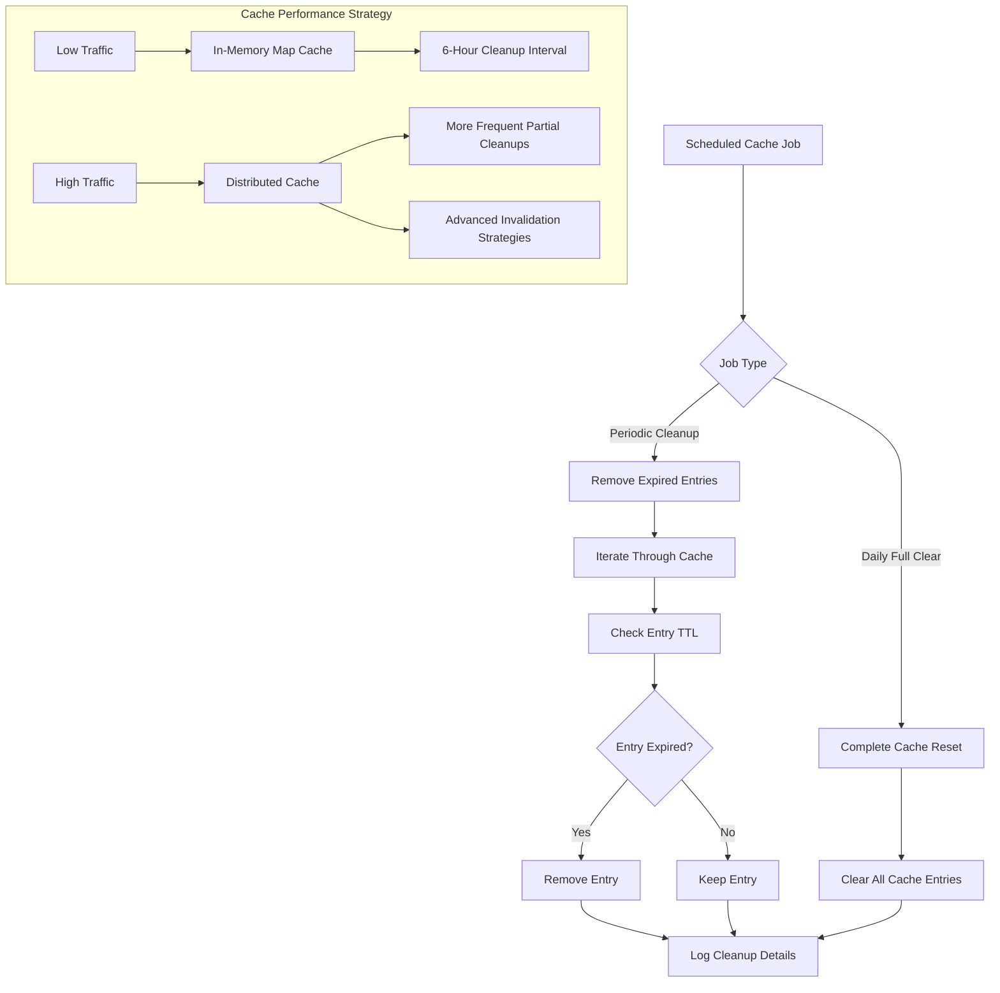

### Performance and Scalability Notes

1. **Current Implementation**:

   - Uses JavaScript's native `Map`
   - Suitable for low-traffic scenarios
   - Cleanup interval of 6 hours

2. **Future Scalability Considerations**:
   - Monitor cache performance
   - Potential migration to Redis for distributed caching
   - Adjust cleanup intervals based on traffic patterns
   - Implement more sophisticated cache invalidation strategies

### Recommended Cleanup Interval Guidelines

- **Low Traffic**: 6-hour cleanup interval
- **Moderate Traffic**: 30-minute cleanup interval
- **High Traffic**:
  - More frequent partial cleanups
  - Consider distributed caching solutions

### Monitoring and Logging

- Console logs track cache cleanup operations
- Future improvements may include:
  - Detailed cache performance metrics
  - Automated alerts for cache-related issues
  - Comprehensive logging of cache operations

### GraphQL Handler (`handlers/graphql.ts`)

Manages GraphQL request processing, context setup, and security validation.

### Security Middleware (`security-middleware.ts`)

Implements security validation logic including:

- Project token validation
- Signature verification
- Timestamp validation
- Nonce management

### GraphQL Plugins (`graphql-plugins.ts`)

Custom plugins for GraphQL processing:

- `createNonceStoragePlugin`: Manages nonce validation and storage
- `createMetricsPlugin`: Tracks and logs execution metrics

### CORS Management (`cors-headers.ts`)

Handles Cross-Origin Resource Sharing (CORS) headers and preflight requests.

## Request Flow

1. **Request Received**: Worker receives HTTP request
2. **CORS Preflight Check**: If OPTIONS request, handle CORS preflight
3. **Route Determination**: Based on URL path
   - `/graphql` → GraphQL processing
   - `/kv-site-assets` → KV synchronization
   - Other paths → 404 response
4. **Security Validation**:
   - Project token verification
   - Gateway headers validation
   - Timestamp and signature checks
5. **Context Creation**: Build GraphQL context with:
   - User session information
   - Service APIs
   - Security context
6. **Request Processing**: Execute GraphQL operation or KV sync
7. **Response Generation**: Format response with appropriate CORS headers

## Directory Structure (src/directory)

```
├── handlers/
│   ├── graphql.ts             # GraphQL request handler
│   ├── kv-sync.ts             # KV synchronization handler
│   ├── security-middleware.ts # Security validation middleware
│   └── graphql-plugins.ts     # GraphQL plugins for nonce and metrics
├── services/
│   ├── helper                 # Helper file for date formatting, validators, etc.
│   ├── index.ts               # Service exports
│   ├── category-service.ts    # Category management services
│   └──expense-service.ts      # Expense tracking services
├── schemas/
│   └── index.ts               # Schema exports (from typeDefs)
├── datasources/
│   ├── category.ts            # Category data access
│   └── expense.ts             # Expense data access
├── resolvers/
|   ├── index.ts
|   ├──  nested-resolvers.ts
│   └── category/
│     ├──mutations/
│     └── queries/
│   └── expense/
│     ├──mutations/
│     └── queries/
├── types/
│   └── index.ts               # Type exports (GraphQL schema)
├── cors-headers.ts            # CORS handling utilities
├── index.ts                   # Main worker entry point
```

## DB Structure

The Expense Tracker Service uses the following database schema:

### Expense Tags Table (`expense_tags`)

| Field       | Types   | Constraint   | Format   |
| ----------- | ------- | ------------ | -------- |
| id          | TEXT    | PK, NOT NULL |          |
| name        | TEXT    | NOT NULL     |          |
| created_at  | INTEGER | NOT NULL     | DateTime |
| updated_at  | INTEGER | NOT NULL     | DateTime |
| created_by  | TEXT    | NOT NULL     |          |
| updated_by  | TEXT    | NOT NULL     |          |
| is_disabled | INTEGER | DEFAULT 0    | Boolean  |

**Indexes**

- `idx_unique_tags_name` (UNIQUE) on **name**

### Expense Modes Table (`expense_modes`)

| Field       | Types   | Constraint   | Format   |
| ----------- | ------- | ------------ | -------- |
| id          | TEXT    | PK, NOT NULL |          |
| name        | TEXT    | NOT NULL     |          |
| created_at  | INTEGER | NOT NULL     | DateTime |
| updated_at  | INTEGER | NOT NULL     | DateTime |
| created_by  | TEXT    | NOT NULL     |          |
| updated_by  | TEXT    | NOT NULL     |          |
| is_disabled | INTEGER | DEFAULT 0    | Boolean  |

**Indexes**

- `idx_unique_modes_name` (UNIQUE) on **name**

### Expense Fynix Table (`expense_fynix`)

| Field       | Types   | Constraint   | Format   |
| ----------- | ------- | ------------ | -------- |
| id          | TEXT    | PK, NOT NULL |          |
| name        | TEXT    | NOT NULL     |          |
| created_at  | INTEGER | NOT NULL     | DateTime |
| updated_at  | INTEGER | NOT NULL     | DateTime |
| created_by  | TEXT    | NOT NULL     |          |
| updated_by  | TEXT    | NOT NULL     |          |
| is_disabled | INTEGER | DEFAULT 0    | Boolean  |

**Indexes**

- `idx_unique_fynix_name` (UNIQUE) on **name**

### Expense Tracker Table (`expense_tracker`)

| Field          | Types   | Constraint   | Format   |
| -------------- | ------- | ------------ | -------- |
| id             | TEXT    | PK, NOT NULL |          |
| user_id        | TEXT    | NOT NULL     |          |
| expense_period | TEXT    | NOT NULL     |          |
| amount         | REAL    | NOT NULL     |          |
| description    | TEXT    | Nullable     |          |
| item_details   | TEXT    | Nullable     |          |
| tag_id         | TEXT    | NOT NULL, FK |          |
| mode_id        | TEXT    | NOT NULL, FK |          |
| fynix_id       | TEXT    | NOT NULL, FK |          |
| status         | TEXT    | NOT NULL     |          |
| created_at     | INTEGER | NOT NULL     | DateTime |
| updated_at     | INTEGER | NOT NULL     | DateTime |
| created_by     | TEXT    | NOT NULL     |          |
| updated_by     | TEXT    | NOT NULL     |          |
| is_disabled    | INTEGER | DEFAULT 0    | Boolean  |

**Foreign Key Constraints**

- `tag_id` references `expense_tags(id)`
- `mode_id` references `expense_modes(id)`
- `fynix_id` references `expense_fynix(id)`

**Indexes**

- `idx_expense_tracker_user_id` on **user_id**
- `idx_user_expense_period` on **user_id** and **expense_period**
- `idx_foreign_keys` on **tag_id**, **mode_id**, and **fynix_id**
- `composite_tag_amount` on **tag_id** and **amount**
- `composite_mode_amount` on **mode_id** and **amount**
- `composite_fynix_amount` on **fynix_id** and **amount**

**ER diagram**

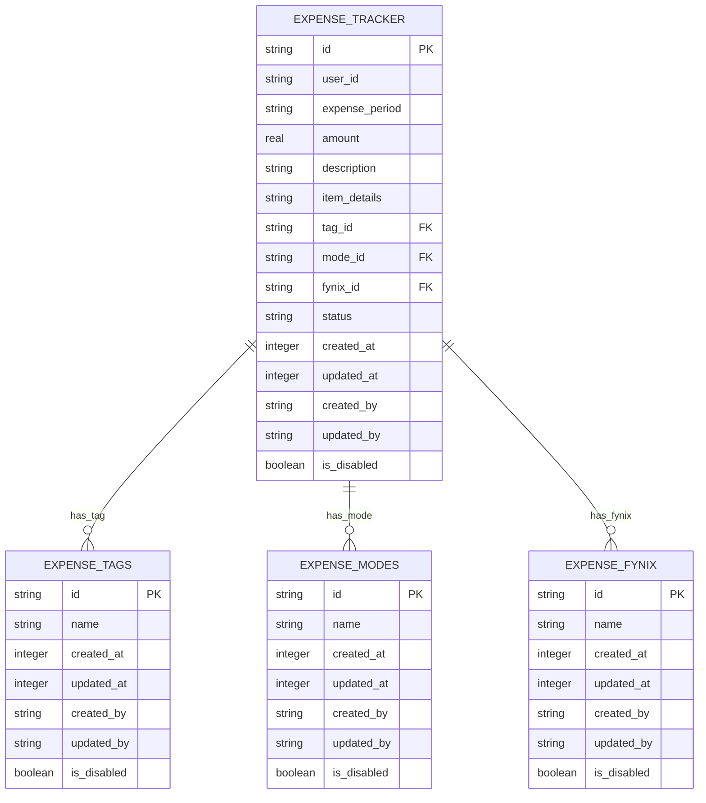

## GraphQL Schema

### GraphQL Schema (Types)

```GraphQL
scalar DateTime

# Expense Status Enum
enum ExpenseStatus {
  Paid
  UnPaid
  NextDue
}

# Sorting and Pagination Enums
enum Sort {
  ASC
  DESC
}

# TODO: use SortBy (PascalCase)
enum SORT_BY {
  CREATED_AT
  UPDATED_AT
  AMOUNT
}

# Enum for different category types
enum CategoryType {
  EXPENSE_TAG
  EXPENSE_MODE
  EXPENSE_FYNIX
}

# Generic category type to represent different category entities - we not using this for now
type GenericCategoryResponse {
  id: ID!
  name: String!
  category_type: CategoryType!
  created_at: DateTime!
  updated_at: DateTime!
  created_by: String!
  updated_by: String!
  is_disabled: Boolean!
}

type Category {
  id: ID!
  name: String!
  created_at: DateTime!
  updated_at: DateTime!
  created_by: String!
  updated_by: String!
}

type CategorySuccessResponse {
  id: ID!
  name: String!
  category_type: CategoryType!
}

type CategoryResponse {
  success: Boolean!
  category: CategorySuccessResponse
}

# Generic input for creating/updating categories
input CreateCategoryInput {
  category_type: CategoryType!
  name: String!
}

input UpdateCategoryInput {
  id: ID!
  category_type: CategoryType!
  name: String!
}

input DeleteCategoryInput {
  id: ID!
  category_type: CategoryType!
}

input CategoryFilter {
  id: ID
  search: String # Allow partial name matching
}

# Expense Tracker Type
type ExpenseTracker {
  id: ID!
  user_id: String!
  expense_period: String!
  amount: Float!
  description: String
  item_details: String
  tag_id: ID!
  mode_id: ID!
  fynix_id: ID!
  tag: Category!
  mode: Category!
  fynix: Category!
  status: ExpenseStatus!
  created_at: DateTime!
  updated_at: DateTime!
  created_by: String!
  updated_by: String!
  is_disabled: Boolean!
}

type ExpenseTrackerSuccessResponse {
  id: ID!
  user_id: String!
  expense_period: String!
  amount: Float!
  description: String
  item_details: String
  status: ExpenseStatus!
  tag_id: ID!
  mode_id: ID!
  fynix_id: ID!
  created_at: DateTime!
  updated_at: DateTime!
  created_by: String!
  updated_by: String!
}

# Edge and Connection Types for Pagination
type ExpenseTrackerEdge {
  node: ExpenseTracker!
  cursor: String!
}

type PageInfo {
  endCursor: String
  hasNextPage: Boolean!
}

type ExpenseTrackerConnection {
  edges: [ExpenseTrackerEdge!]!
  pageInfo: PageInfo!
}

type ExpenseTrackerResponse {
  success: Boolean!
  expenseTracker: ExpenseTrackerSuccessResponse
}

# Input Type for Expense Tracker
input CreateExpenseTrackerInput {
  user_id: ID!
  expense_period: String!
  amount: Float!
  description: String
  item_details: String
  tag_id: ID!
  mode_id: ID!
  fynix_id: ID!
  status: ExpenseStatus!
}

input UpdateExpenseTrackerInput {
  id: ID!
  user_id: ID!
  expense_period: String!
  amount: Float!
  description: String
  item_details: String
  tag_id: ID!
  mode_id: ID!
  fynix_id: ID!
  status: ExpenseStatus!
}

input DeleteExpenseTrackerInput {
  id: ID!
  user_id: ID!
}

# Paginated Inputs
input PaginatedExpenseInputs {
  user_ids: [ID] # User filtering (for admin)
  expense_period: String
  tag_ids: [ID]
  mode_ids: [ID]
  fynix_ids: [ID]

  # Amount range filtering
  min_amount: Float
  max_amount: Float

  # Status filtering
  statuses: [ExpenseStatus]

  # Pagination and sorting
  first: Int = 10
  after: String
  sort: Sort = DESC
  sort_by: SORT_BY = CREATED_AT
}

# Query Types
type Query {
  expenseTags(input: CategoryFilter): [Category]
  expenseModes(input: CategoryFilter): [Category]
  expenseFynixes(input: CategoryFilter): [Category]

  # Expense Tracker Queries
  expenseTrackerById(session_id: ID!, id: ID!): ExpenseTracker
  expenseTrackerByUserIds(session_id: ID!, user_ids: [ID!]!): [ExpenseTracker]!
  paginatedExpenseTrackers(session_id: ID!, input: PaginatedExpenseInputs): ExpenseTrackerConnection!
}

# Mutation Types
type Mutation {
  # Generic mutation for creating/updating/deleting category
  createCategory(input: CreateCategoryInput!): CategoryResponse!
  updateCategory(input: UpdateCategoryInput!): CategoryResponse!
  deleteCategory(input: DeleteCategoryInput!): Boolean!

  # Expense Tracker Mutations
  createExpenseTracker(input: CreateExpenseTrackerInput!): ExpenseTrackerResponse!
  updateExpenseTracker(input: UpdateExpenseTrackerInput!): ExpenseTrackerResponse!
  deleteExpenseTracker(input: DeleteExpenseTrackerInput!): Boolean!
}
```

**Schema ER Diagram**

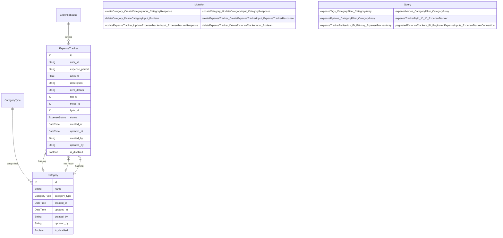

## Service API Interfaces and Data Sources

### Category Service (`services/category-service.ts`)

**Service Methods:**

```typescript
class CategoryService {
  constructor(private dataSources: DataSources) {}

  async getCategories(type: CategoryType, filter?: CategoryFilter): Promise<Category[]>;
  async getCategoryById(id: string, type: CategoryType): Promise<Category | null>;
  async createCategory(data: CreateCategoryInput, sessionUser: SessionUserType): Promise<CategorySuccessResponse>;
  async updateCategory(data: UpdateCategoryInput, sessionUser: SessionUserType): Promise<CategorySuccessResponse>;
  async deleteCategory(data: DeleteCategoryInput, sessionUser: SessionUserType): Promise<boolean>;
}
```

### Expense Service (`services/expense-service.ts`)

**Service Methods:**

```typescript
class ExpenseService {
  constructor(private dataSources: DataSources) {}

  async getExpenseById(id: string, sessionId: string): Promise<ExpenseTracker | null>;
  async getExpensesByUserIds(sessionId: string, userIds: string[]): Promise<ExpenseTracker[]>;
  async getPaginatedExpenses(sessionId: string, input: PaginatedExpenseInputs): Promise<ExpenseTrackerConnection>;
  async createExpense(data: CreateExpenseTrackerInput, sessionUser: SessionUserType): Promise<ExpenseTrackerSuccessResponse>;
  async updateExpense(data: UpdateExpenseTrackerInput, sessionUser: SessionUserType): Promise<ExpenseTrackerSuccessResponse>;
  async deleteExpense(data: DeleteExpenseTrackerInput, sessionUser: SessionUserType): Promise<boolean>;
}
```

### Data Sources

- **Category Data Source** (`datasources/category.ts`): Handles CRUD operations for categories
- **Expense Data Source** (`datasources/expense.ts`): Handles CRUD operations for expenses

### Component Interaction Flow

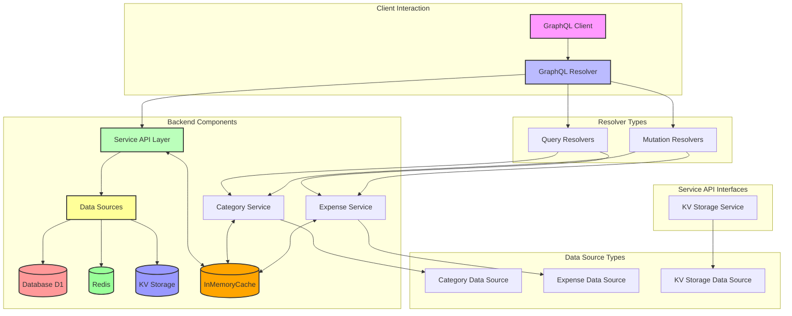

## Error Handling

The service implements structured error handling with GraphQL error extensions:

```typescript
throw new GraphQLError("Error message", {
  extensions: {
    code: "ERROR_CODE",
    status: 4xx, // HTTP status code
    // Additional metadata
  }
});
```

**General Principles**

1. **Explicit Error Types**: Define custom error types that clearly describe different error conditions.
2. **Error Codes**: Assign unique error codes to different types of errors for easy identification and localization of error messages.
3. **Consistent Structure**: Ensure that all errors returned from the API have a consistent structure.
4. **Detailed Messages**: Provide detailed error messages that offer insights into why an operation failed.
5. **User-Friendly Language**: Error messages should be in user-friendly language.

**Implementing Error Responses**

**GraphQL Error Object**: Utilize the GraphQL `errors` object to return errors. Each error can include:

1. **`message`**: A human-readable error message.
2. **`extensions`**: An optional field that can include additional details such as error codes, type of error, and other relevant information.

### Error Flow

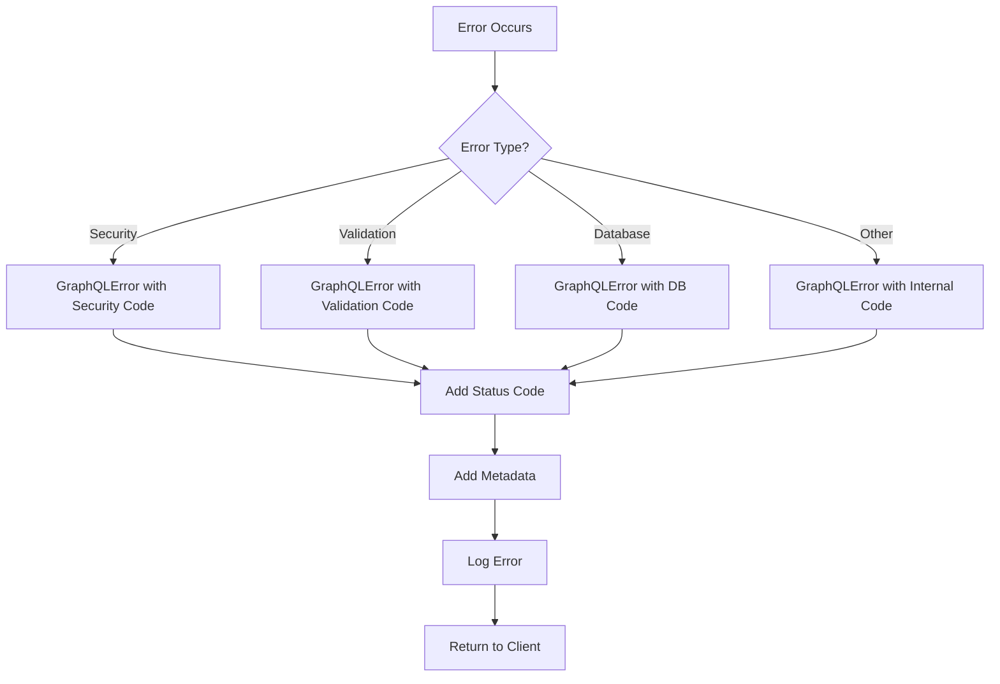

### Common Error Codes

- `UNAUTHORIZED`: Invalid project token
- `GATEWAY_UNAUTHORIZED`: Missing security headers
- `INVALID_SIGNATURE`: Signature verification failed
- `REQUEST_TIMEOUT`: Request timestamp too old
- `REPLAY_ATTACK`: Nonce already used
- `VALIDATION_ERROR`: Input validation failed
- `NOT_FOUND`: Requested resource not found
- `FORBIDDEN`: Insufficient permissions
- `INTERNAL_SERVER_ERROR`: Unexpected server error

## Testing

- **Unit Tests**
  - Unit tests for resolver functions
- **End-to-End (E2E) Tests**
  - Complete user service workflows which includes CRUD operations should be tested.
  - Use Playwright or Selenium

## Deployment and CI/CD

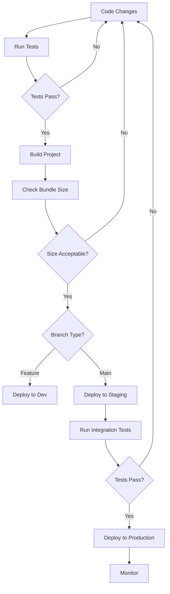

## References

- [Cache Implementation - Expense Service API - Documentation (Expense Tracker)](cache-expense-services-api.md) - Contains detailed specifications for the expense tracker caching system.

- [GraphQL Nested Resolvers: Deep Dive](graphQL-nested-resolvers.md) - Contains detailed specifications for the GraphQL Nested Resolvers.

## Conclusion

The above schema and other information needs to be in alliance with the conventions present in the ADRs.
