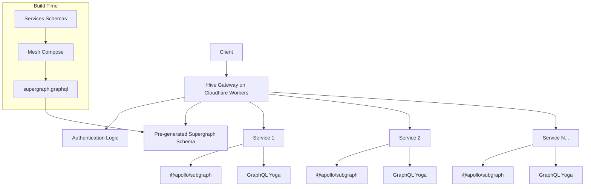
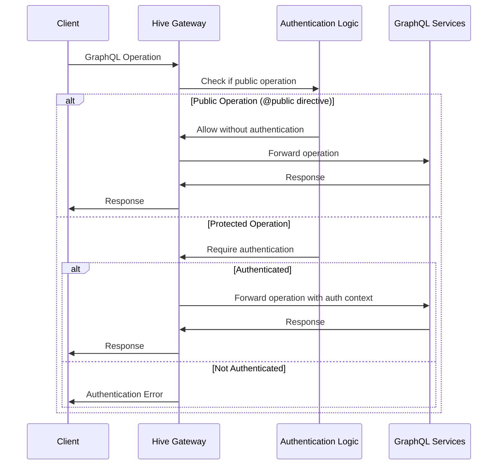
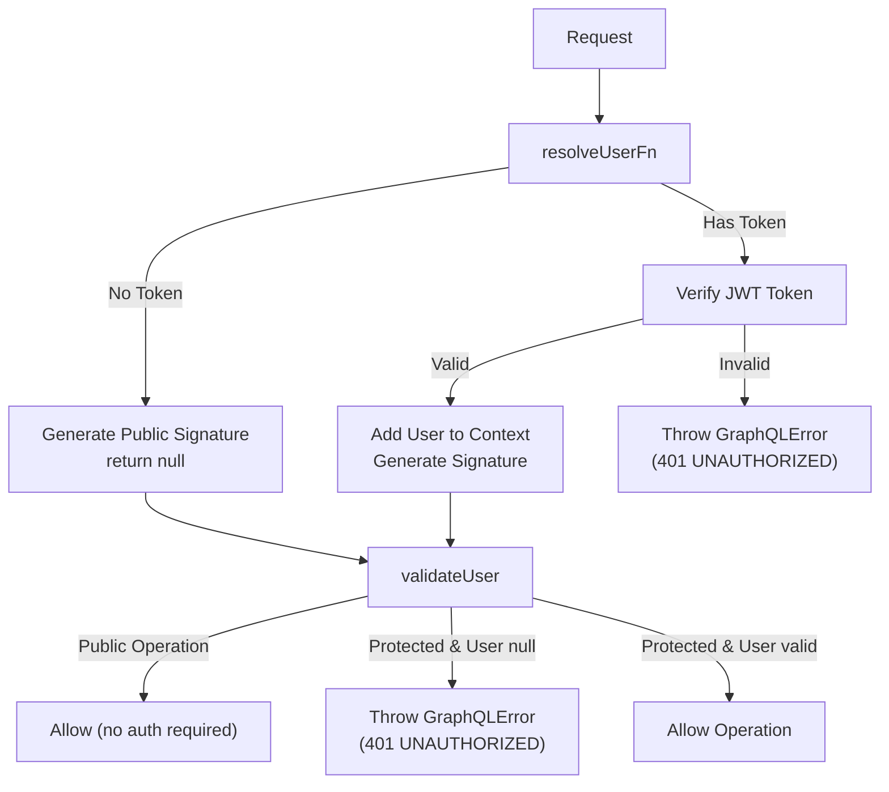
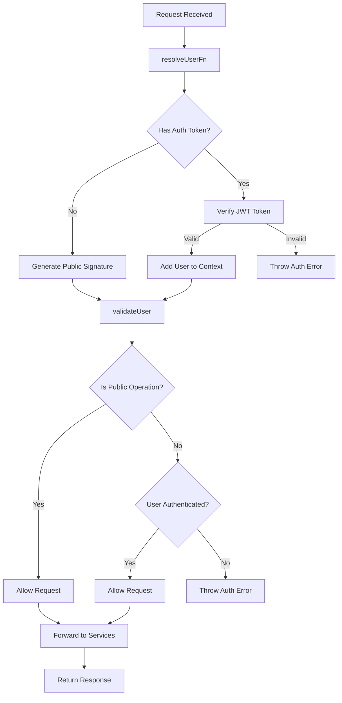

# GraphQL Gateway Implementation Documentation

## Overview

This document explains the architecture and implementation details of our modular GraphQL gateway. The gateway serves as a unified entry point for GraphQL operations, handling authentication, request routing, and resource management.

## Architecture

The gateway is designed with modularity in mind, separating concerns into distinct components:

- **Request Handling** (`index.ts`): Manages the main request flow, CORS handling, and error responses
- **Gateway Initialization** (`gateway.ts`): Configures and creates the gateway runtime
- **Authentication** (`auth-functions.ts`): Handles user resolution and request validation
- **Service Routing** (`service-router.ts`): Routes requests to appropriate backend services



## Request Flow


## Resource Management

The gateway implements proper resource management using the ECMAScript standard `Symbol.asyncDispose`. This ensures connections, caches, and other resources are properly released after a request is handled.

### Disposal Process


### Implementation Details

The gateway uses Cloudflare Worker's `ctx.waitUntil()` method to handle asynchronous resource disposal without blocking the client response. This approach ensures:

1. Fast response times as clients don't wait for cleanup
2. Proper resource management to prevent memory leaks
3. Efficient use of connection pools and other limited resources

## Code Structure

### Main Request Handler (`index.ts`)

```typescript
export default {
  async fetch(request: Request, env: Env, ctx: ExecutionContext): Promise<Response> {
    // Handle CORS preflight
    if (request.method === "OPTIONS") return handleCorsPreflight();

    try {
      // Initialize the gateway runtime
      const gateway = initializeGateway(env);

      // Process the request
      const response = await gateway(request);

      // Schedule disposal of the gateway (non-blocking)
      disposeGateway(gateway, ctx);

      return addCorsHeaders(response);
    } catch (error) {
      // Error handling...
    }
  },
};
```

### Gateway Disposal

```typescript
const disposeGateway = (gateway: any, ctx: ExecutionContext) => {
  const disposeMethod = gateway[Symbol.asyncDispose];
  if (typeof disposeMethod === "function") {
    const disposePromise = disposeMethod.call(gateway);
    ctx.waitUntil(Promise.resolve(disposePromise));
  }
};
```

### 2. Authentication Logic Implementation

We use a custom authentication checker to determine if an operation accesses only fields with the `@public` directive.

The implementation follows these steps:

- Extract the document, schema, and operation name from execution arguments
- Find the operation definition within the document
- Determine the root type based on the operation type (query, mutation)
- Recursively check if the requested fields have the @public directive
- Return true if the operation only accesses public fields, false otherwise

## Authentication Flow



### Authentication Functions

The gateway uses two main authentication functions:



#### Key authentication functions:

The resolver function processes the incoming request by:

- Generating a timestamp and nonce for security purposes
- Checking for an Authorization header
- For unauthenticated requests, generating a public operation signature
- For authenticated requests, verifying the JWT token and extracting user information
- Adding signature and user data to the context for downstream services

The validator function determines if the request should proceed by:

- Checking if the operation is public using the @public directive
- Allowing public operations to proceed without authentication
- For protected operations, ensuring the user is authenticated
- Throwing an error for protected operations without valid authentication

```typescript
// Example of authentication functions (simplified)
const resolveUserFn: ResolveUserFn<User> = async (context: any) => {
  return user;
};

const validateUser: ValidateUserFn<any> = ({ user, executionArgs }) => {
  // Check if operation is public using the @public directive
  if (isPublicOperation(executionArgs)) {
    return; // Allow public operations
  }

  // For non-public operations, validate authentication
  if (user === null) {
    throw new GraphQLError("Authentication failed for non-public operation", {
      extensions: { code: "UNAUTHORIZED", status: 401 },
    });
  }
};
```

## Gateway Authentication Process



## Best Practices

1. **Always dispose after use**: Schedule gateway disposal after processing the request, never before
2. **Use non-blocking disposal**: Leverage `ctx.waitUntil()` to handle cleanup in the background
3. **Separate concerns**: Keep authentication, routing, and request handling in separate modules
4. **Error handling**: Provide meaningful error responses with appropriate status codes

## Troubleshooting

Common issues:

1. **Gateway disposed before use**: If you see errors about using a disposed gateway, check that disposal is scheduled after the request is processed
2. **Authentication failures**: Verify JWT configuration and token validity
3. **Service routing issues**: Ensure service URLs are configured correctly
