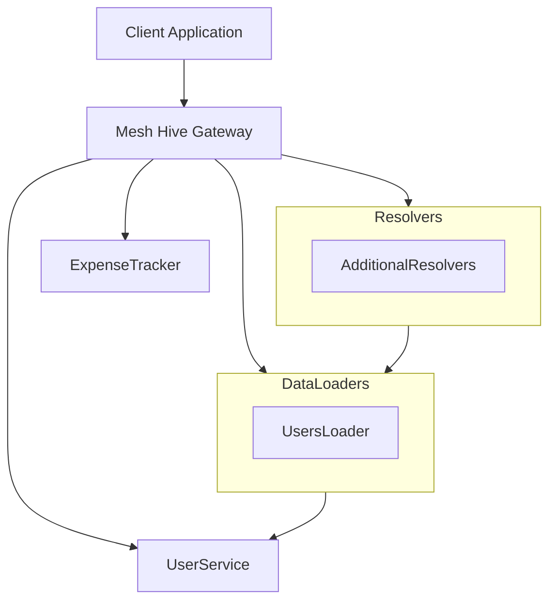
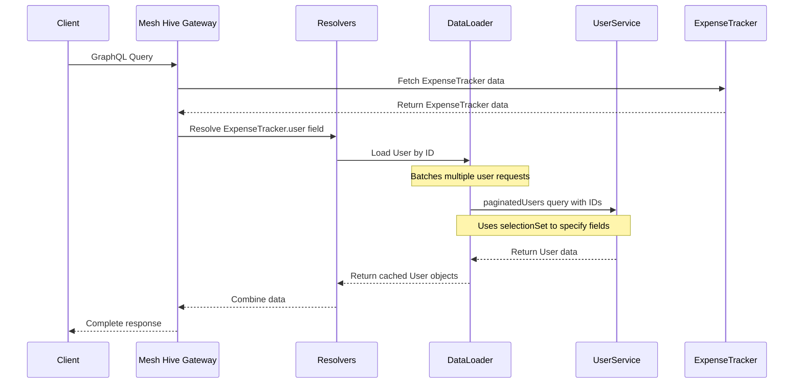
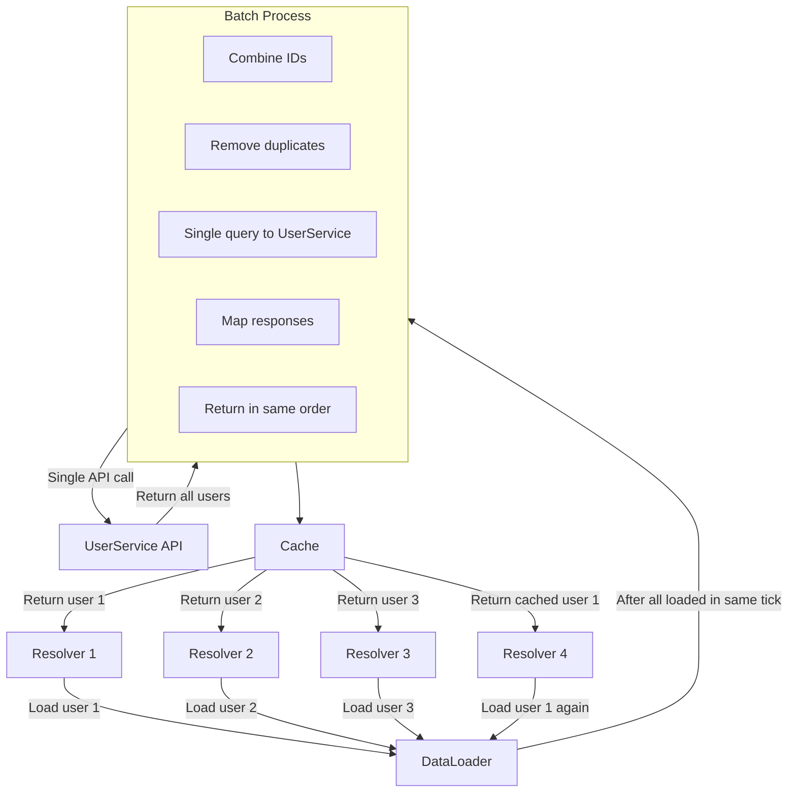
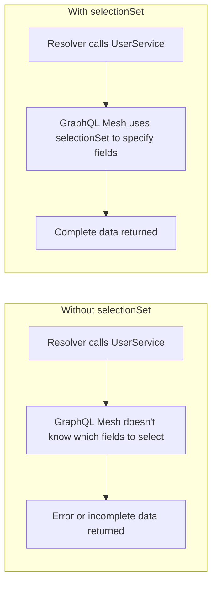
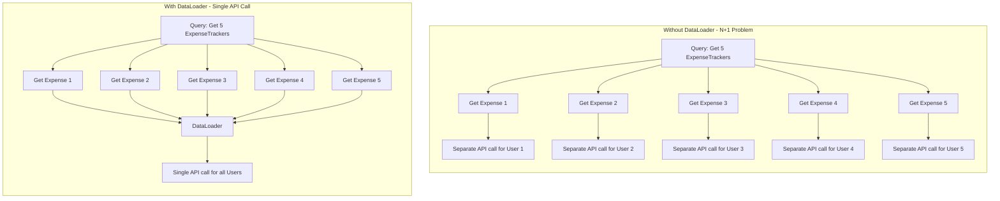
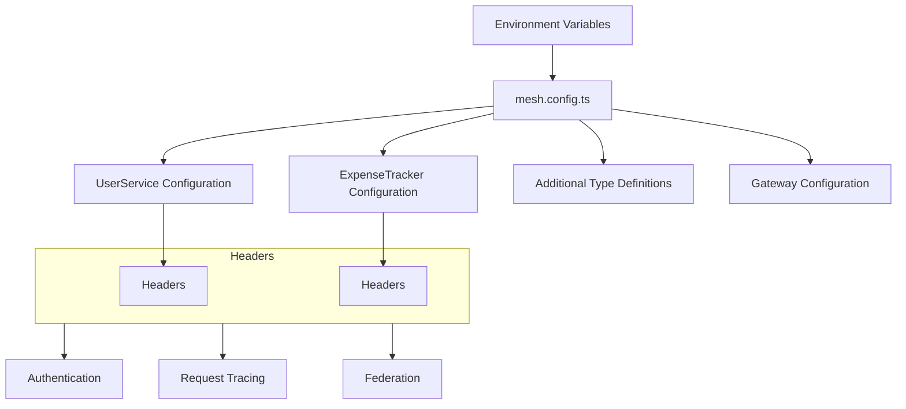
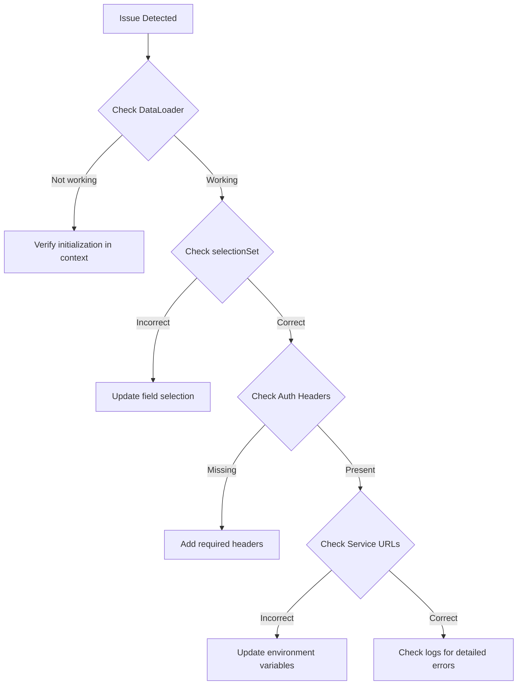

# GraphQL Federation Documentation - Mesh v1 & hive gateway

## Overview

This documentation covers a GraphQL federation setup using GraphQL Mesh and Hive Gateway. The system connects multiple microservices (UserService and ExpenseTracker) into a unified GraphQL API with proper data loading patterns to avoid N+1 query problems.

## Architecture



## Request Flow



## DataLoader Operation



## Key Components

### 1. Mesh Configuration (`mesh.config.ts`)

The configuration defines:

- Subgraph connections to microservices (UserService and ExpenseTracker)
- Authentication and security headers
- Environment-specific configurations
- Type extension for federation

### 2. Additional Resolvers (`additional-resolvers.ts`)

Resolvers that extend the federated schema, particularly:

- Connecting an ExpenseTracker to its associated User

### 3. DataLoader Implementation (`user-by-id-loader.ts`)

A batched data loading pattern to efficiently fetch user data and prevent N+1 query problems.

## The `selectionSet` Parameter

### Important Note

The `selectionSet` parameter is **required** when working with non-scalar fields in GraphQL Mesh. This is a critical implementation detail that may not be immediately obvious.

### What is `selectionSet`?

The `selectionSet` defines which fields should be selected when querying a GraphQL service. In our implementation, it specifies:

```graphql
{
  edges {
    cursor
    node {
      id
      name
      email
      role
      phone
      address
      city
      state
      country
      zipcode
      created_at
      updated_at
      created_by
      updated_by
    }
  }
  pageInfo {
    endCursor
    hasNextPage
  }
}
```

### Why is it required?

1. **Explicit Field Selection**: GraphQL Mesh needs to know exactly which fields to request from the underlying service.
2. **Non-Scalar Resolution**: For complex types (like User objects), you must specify the complete field structure.
3. **Predictable Performance**: Explicit selection sets prevent over/under-fetching of data.



### Common Pitfalls

1. **Missing `selectionSet`**: Will result in errors when resolving non-scalar fields
2. **Incomplete fields**: If your selection set doesn't include fields that your resolvers need, you'll get null values or errors
3. **Performance issues**: Over-selecting fields can cause unnecessary data transfer

## DataLoader Implementation

The `createUsersLoader` function implements efficient batch loading:

```typescript
export const createUsersLoader = (context: HiveGatewayContext, info: GraphQLResolveInfo): DataLoader => {
  // Implementation details...

  return new DataLoader(
    async (userIds: readonly string[]): Promise> => {
      // Batch loading implementation...
    },
    {
      maxBatchSize: 20,
      batchScheduleFn: (callback) => setTimeout(callback, 0),
    }
  );
};
```

### Key Features:

1. **Batch Loading**: Combines multiple individual requests into a single query
2. **Caching**: Automatically caches results to prevent duplicate requests
3. **Consistent Ordering**: Returns results in the same order as the requested IDs
4. **Error Handling**: Properly propagates and logs errors

## N+1 Problem Solved



## Environment Configuration

The system supports different environments through environment variables:

- `LOCAL_*` URLs for development
- `PROD_*` URLs for production
- Security tokens and signatures for authentication

## Configuration Flow



## Best Practices

1. **Always specify `selectionSet`** when working with non-scalar fields
2. **Use DataLoader pattern** to avoid N+1 query problems
3. **Implement proper error handling** at each resolver level
4. **Set appropriate timeout and retry values** for network resilience
5. **Keep security headers consistent** across services

## Troubleshooting

### Common Errors

1. **"Cannot read properties of undefined (reading 'load')"**

   - Check if the DataLoader is properly initialized in the context

2. **"UserService does not have a valid paginatedUsers query method"**

   - Verify that the UserService schema includes the paginatedUsers query

3. **Missing fields in returned data**

   - Verify that your `selectionSet` includes all needed fields

4. **Authentication failures**
   - Check that all required headers are being properly propagated

## Debugging Tips


