# Gateway v2 Authentication Documentation

## 1. Overview

Gateway v2 introduces significant enhancements to the authentication system with improved token verification, caching strategies, and fault tolerance. Key improvements include:

- **Token caching**: In-memory cache to reduce Redis lookups and improve performance
- **Token versioning**: Redis-backed token version control for security and session management
- **Batch processing**: KV Queue for efficient error logging and reduced I/O operations
- **Enhanced error handling**: Detailed error reporting and standardized error codes
- **Fault tolerance**: Circuit breaker pattern to handle Redis failures gracefully

## 2. Authentication Architecture

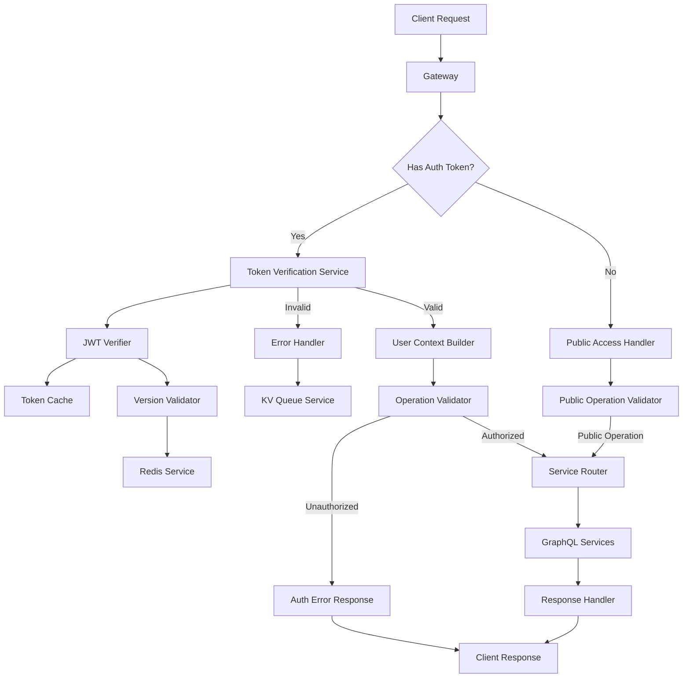

The architecture consists of interconnected components that work together to authenticate requests and authorize operations. The JWT verification service integrates with a token cache and version validator to efficiently process authentication requests.

## 3. Key Components

### 3.1. Authentication Flow

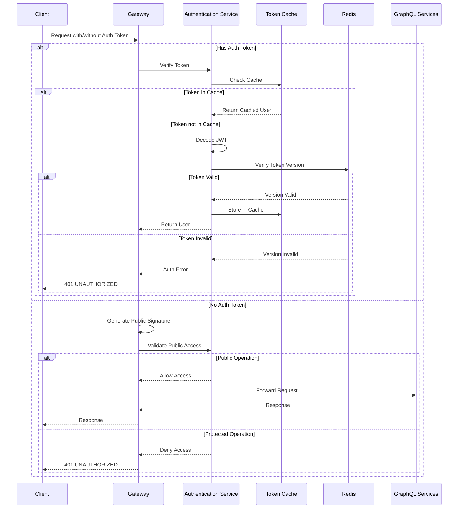

The authentication flow begins when a request is received by the Gateway. The system checks for an authorization token and processes it accordingly. With a token, the system verifies its validity using caching and version control. Without a token, the system checks if the operation is public, allowing unauthenticated access only to operations marked with the `@public` directive.

### 3.2. Token Verification Process

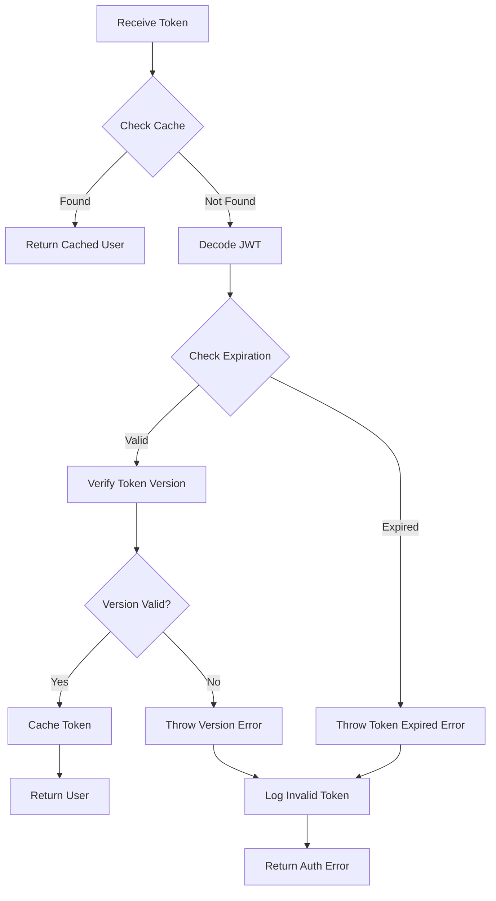

The token verification process implements a multi-stage validation approach:

1. **Cache check**: Verify if token is already in the in-memory cache
2. **JWT decode and validation**: Decode and check token signature and expiration
3. **Version validation**: Compare token version with stored version in Redis
4. **Result caching**: Store valid tokens in memory for future requests

**Key Code: Token Verification**

```typescript
export const jwtVerifyToken = async ({
  token,
  secret,
  kvStorage,
  redis,
  ENVIRONMENT,
}: {
  token: string;
  secret: string;
  kvStorage: KVNamespace;
  redis: Redis;
  ENVIRONMENT: string;
}): Promise<TokenPayload> => {
  try {
    // Check cache first
    const cacheKey = `${token}:${ENVIRONMENT}`;
    const cachedResult = tokenCache.get(cacheKey);
    if (cachedResult && cachedResult.expiry > Date.now()) {
      return cachedResult.payload;
    }

    // Verify JWT token
    const payload = jwt.verify(token, secret) as TokenPayload;

    // Check expiration
    if (payload.exp && payload.exp * 1000 < Date.now()) {
      throw new GraphQLError("Token expired", {
        extensions: { code: "TOKEN_EXPIRED" },
      });
    }

    // Verify token version
    await verifyTokenVersion(payload, redis, ENVIRONMENT);

    // Cache successful result
    tokenCache.set(cacheKey, {
      payload,
      expiry: Date.now() + CACHE_TTL,
    });

    return payload;
  } catch (error) {
    console.error("Error verifying token:", error);
    handleTokenError(error, token, kvStorage, ENVIRONMENT);
  }
};
```

### 3.3. Error Handling System

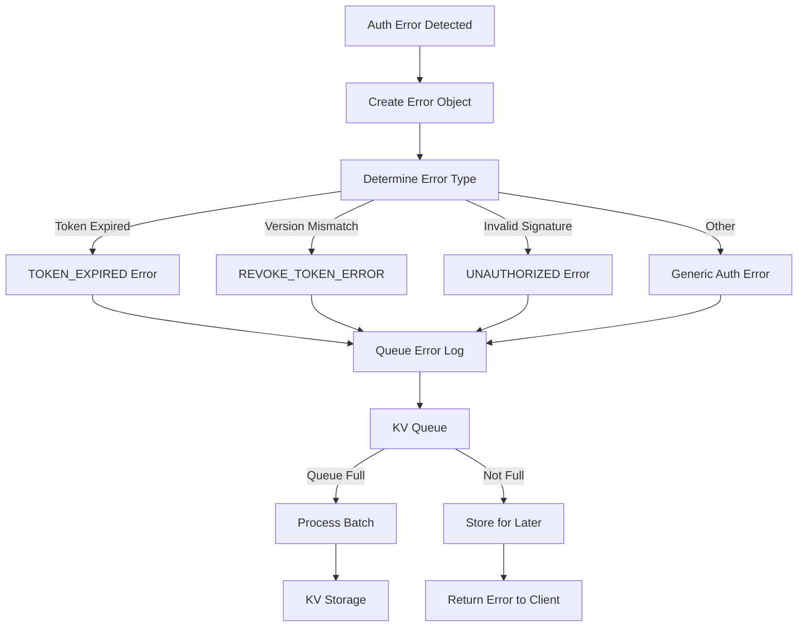

The error handling system provides standardized error reporting with efficient logging:

- Categorizes errors by type (expired, revoked, invalid)
- Uses batch processing for efficient KV storage operations
- Returns standardized GraphQL errors with appropriate status codes

**Key Code: Error Handling**

```typescript
function handleTokenError(error: unknown, token: string, kvStorage: KVNamespace, environment: string): never {
  // Get or create queue for this KV namespace
  if (!kvQueuesMap.has(kvStorage)) {
    kvQueuesMap.set(kvStorage, new KvQueue(kvStorage));
  }
  const queue = kvQueuesMap.get(kvStorage)!;

  // Queue the KV write with useful diagnostic information
  const logKey = `invalid-token:${environment}:${new Date().toISOString()}`;
  const logValue = JSON.stringify({
    token,
    error: error,
    timestamp: new Date().toISOString(),
  });

  queue.push(logKey, logValue, { expirationTtl: 7 * 24 * 60 * 60 });

  // Throw standardized GraphQL error
  const isGraphQLError = error instanceof GraphQLError;
  throw new GraphQLError(isGraphQLError ? error.message : "Invalid token", {
    extensions: {
      code: isGraphQLError && error.extensions?.code ? error.extensions.code : "UNAUTHORIZED",
      error: isGraphQLError && error.extensions?.error ? error.extensions.error : error,
    },
  });
}
```

## 4. Key Features

### 4.1. Token Caching Mechanism

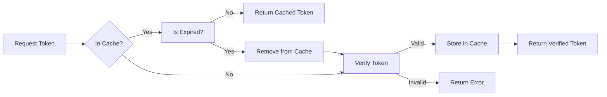

The token caching system reduces load on Redis and improves performance by:

- Storing validated tokens in memory with TTL (Time-To-Live)
- Using a composite cache key with token and environment
- Maintaining cache consistency with token expiration checks

Benefits include:

- Reduced latency for repeated requests from the same user
- Lower Redis query load
- Improved system scalability

### 4.2. Token Version Control

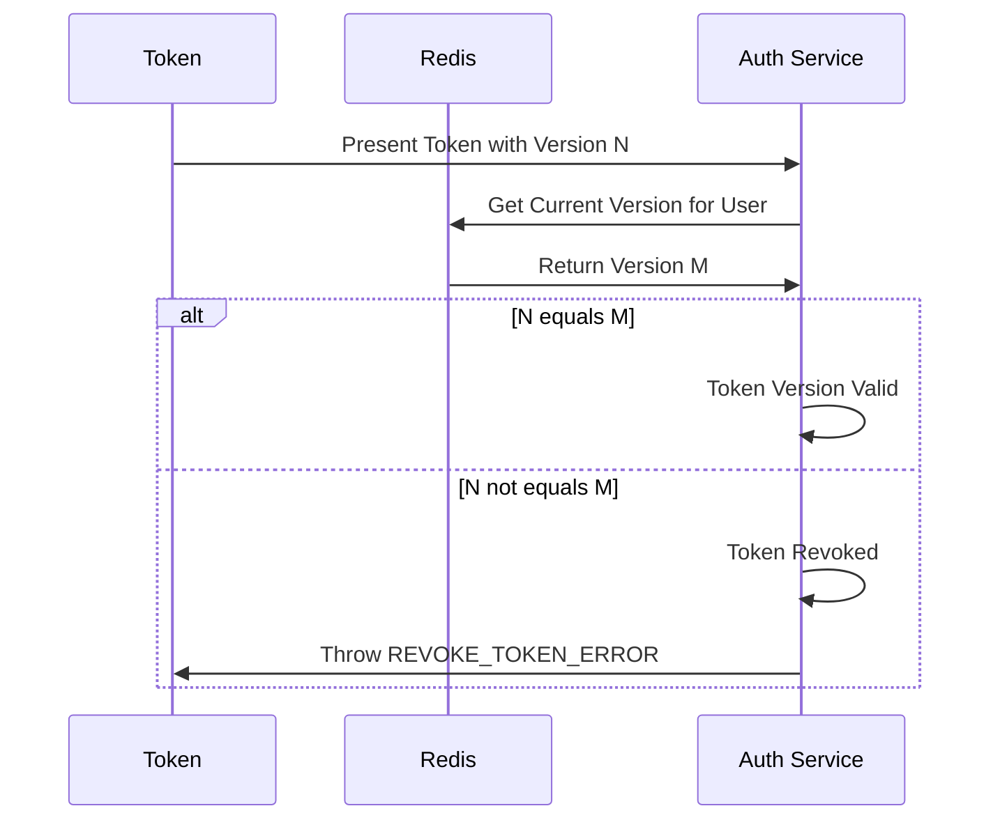

The token version control system provides advanced security features:

- Allows immediate token revocation without changing JWT secrets
- Enables forced logout of specific users or all users
- Creates an audit trail of version changes

**Key Code: Token Version Verification**

```typescript
export async function verifyTokenVersion(payload: TokenPayload, redis: Redis, environment: string): Promise<void> {
  // Fetch current token version from Redis
  const currentVersionStr = await redis.get(`user:${environment}:${payload.email}:tokenVersion`);
  const storedVersion = currentVersionStr ? parseInt(currentVersionStr as string) : 0;

  // Compare token version with stored version
  if (payload.tokenVersion !== storedVersion) {
    throw new GraphQLError("For security reasons, your session is no longer valid. Please sign in again", {
      extensions: {
        code: "REVOKE_TOKEN_ERROR",
        error: `Token has been revoked. payload_version: ${payload.tokenVersion}, stored_version: ${storedVersion}`,
      },
    });
  }
}
```

### 4.3. Public vs Protected Operations

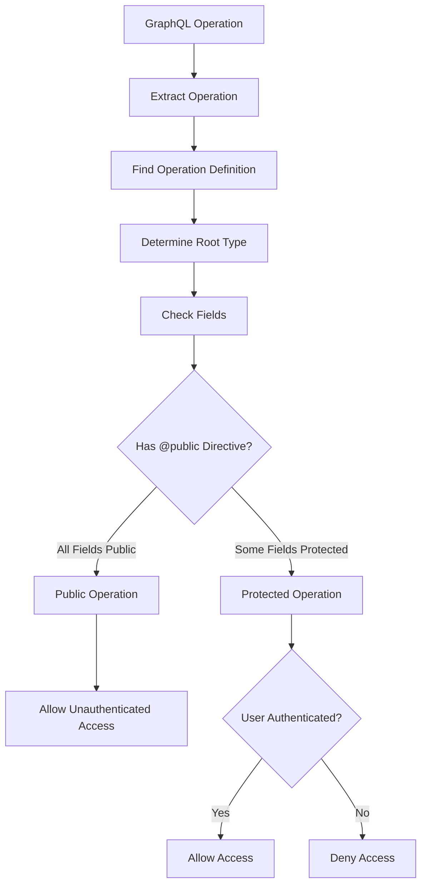

The operation validator intelligently determines if an operation requires authentication:

1. Extracts the GraphQL operation from execution arguments
2. Analyzes fields and directives to determine access requirements
3. Allows unauthenticated access to operations with `@public` directive
4. Enforces authentication for protected operations

By default, all operations require authentication unless explicitly marked as public.

### 4.4. KV Queue for Logging

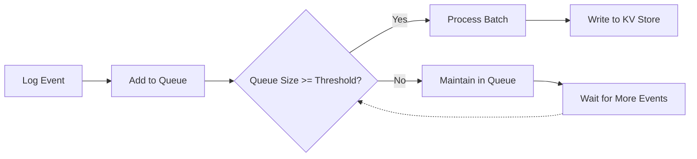

The KV Queue implements efficient batch processing for KV storage operations:

- Reduces KV write operations by batching multiple entries
- Improves performance for high-volume error logging
- Provides configurable queue size threshold

**Key Code: KV Queue Implementation**

```typescript
export class KvQueue {
  private queue: KvQueueItem[] = [];
  private readonly maxQueueSize: number;
  private readonly kvStorage: KVNamespace;

  constructor(kvStorage: KVNamespace, maxQueueSize = 50) {
    this.kvStorage = kvStorage;
    this.maxQueueSize = maxQueueSize;
  }

  push(key: string, value: string, options?: { expirationTtl?: number }) {
    this.queue.push({ key, value, options });

    if (this.queue.length >= this.maxQueueSize) {
      this.process();
    }
  }

  async process() {
    if (this.queue.length === 0) return;

    const batch = [...this.queue];
    this.queue = [];

    await Promise.allSettled(batch.map((item) => this.kvStorage.put(item.key, item.value, item.options)));
  }
}
```

## 5. Gateway Authentication Process

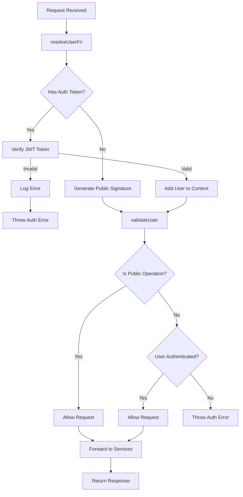

The gateway authentication process involves two critical functions:

1. **resolveUserFn**: Extracts and validates user credentials

   - Generates security timestamp and nonce
   - Verifies JWT tokens and adds user to context
   - Creates appropriate signatures for downstream services

2. **validateUser**: Authorizes access to operations
   - Checks if operation has @public directive
   - Enforces authentication for protected operations
   - Returns appropriate error responses

**Key Code: Authentication Functions**

```typescript
const resolveUserFn: ResolveUserFn<any> = async (context: any) => {
  // Generate security timestamp and nonce
  const timestamp = Date.now().toString();
  const nonce = crypto.getRandomValues(new Uint8Array(16)).reduce((str, byte) => str + byte.toString(16).padStart(2, "0"), "");

  context.gateway_timestamp = timestamp;
  context.gateway_nonce = nonce;

  // Check for auth token
  const accessToken = context.headers?.Authorization;
  if (!accessToken) {
    // Handle public access
    const signaturePayload = `public:${timestamp}:${nonce}`;
    const signature = await generateHmacSignature(env.GATEWAY_SECRET, signaturePayload);
    context.gateway_signature = signature;
    return null;
  }

  try {
    // Verify token with enhanced verification
    const jwtToken = await jwtVerifyToken({
      token: accessToken,
      secret: env.JWT_SECRET,
      kvStorage: env.EXPENSE_AUTH_EVENTS_KV,
      redis,
      ENVIRONMENT: env.ENVIRONMENT,
    });

    // Add user to context
    const user = {
      id: jwtToken.id,
      role: jwtToken.role,
      email: jwtToken.email,
      name: jwtToken.name,
    };
    context.current_session_user = user;

    // Generate signature with user data
    const signaturePayload = `${jwtToken.id}:${jwtToken.role}:${timestamp}:${nonce}`;
    const signature = await generateHmacSignature(env.GATEWAY_SECRET, signaturePayload);
    context.gateway_signature = signature;

    return user;
  } catch (error) {
    console.error("Token verification failed:", error);
    // Handle error and throw standardized GraphQLError
    throw new GraphQLError("Invalid token", {
      extensions: {
        status: 401,
        code: "UNAUTHORIZED",
      },
    });
  }
};

const validateUser: ValidateUserFn<any> = ({ user, executionArgs }) => {
  // Allow public operations without authentication
  if (isPublicOperation(executionArgs)) {
    return;
  }

  // Require authentication for protected operations
  if (user === null) {
    throw new GraphQLError("Authentication failed for non-public operation", {
      extensions: {
        code: "UNAUTHORIZED",
        status: 401,
        error: { message: "Invalid token" },
      },
    });
  }
};
```

## 6. Fault Tolerance Features

### 6.1. Circuit Breaker Pattern

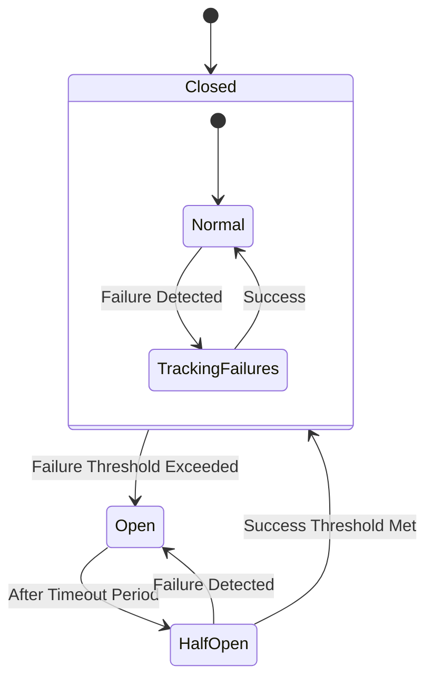

The circuit breaker pattern prevents cascading failures by:

- Monitoring Redis connection failures
- Temporarily bypassing Redis checks when the circuit is open
- Gradually recovering through a half-open state
- Providing fallback mechanisms for token validation

This ensures system resilience even when Redis is temporarily unavailable or experiencing issues.

### 6.2. Request Signature Generation

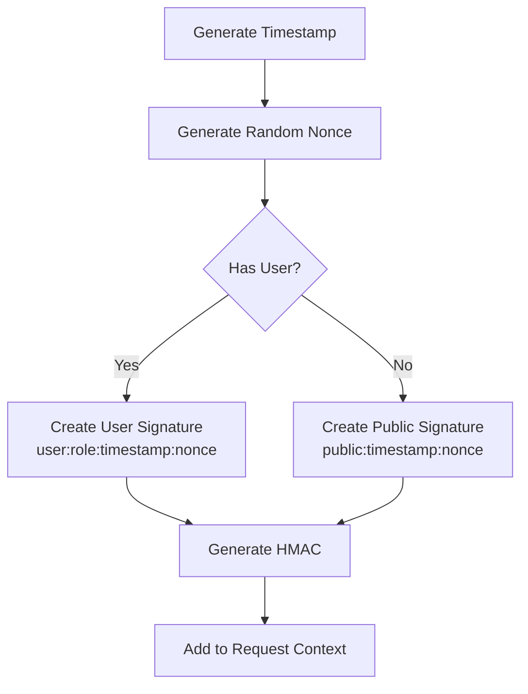

Request signatures provide additional security by:

- Including timestamp to prevent replay attacks
- Using cryptographic nonce for request uniqueness
- Including user information in authenticated requests
- Generating HMAC signatures with gateway secret

Signatures are added to the request context and can be verified by downstream services.

## 7. Best Practices

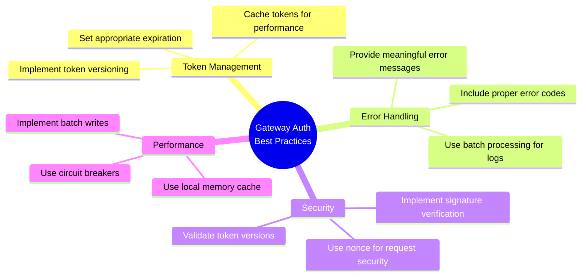

### Token Management

- Use token versioning to allow immediate revocation
- Set appropriate token expiration times
- Implement caching with reasonable TTL values

### Error Handling

- Provide meaningful error messages to clients
- Log detailed error information for debugging
- Use batch processing for efficient logging

### Security Best Practices

- Implement nonce and timestamp in signatures
- Use environment-specific keys for multi-environment deployments
- Always validate token versions

### Performance Optimization

- Use memory caching for frequently accessed tokens
- Batch KV storage operations when possible
- Implement circuit breakers for external dependencies

## 8. Implementation Considerations

### 8.1. Environment Configuration

Required environment variables:

- `JWT_SECRET`: Secret key for JWT token verification
- `GATEWAY_SECRET`: Secret for generating request signatures
- `ENVIRONMENT`: Current environment identifier (dev/staging/prod)
- Redis connection configuration for token version storage

### 8.2. Key Performance Indicators

Monitor these key metrics:

- Authentication response time
- Cache hit ratio for token cache
- Error rates by type (expired, revoked, invalid)
- KV queue processing time

### 8.3. Monitoring Recommendations

For effective monitoring:

- Track invalid token attempts by IP and user
- Monitor Redis performance and connection status
- Watch circuit breaker status and trips
- Log token revocation events
