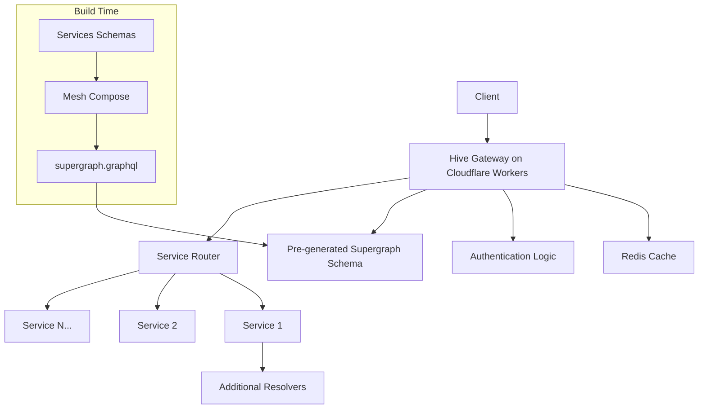
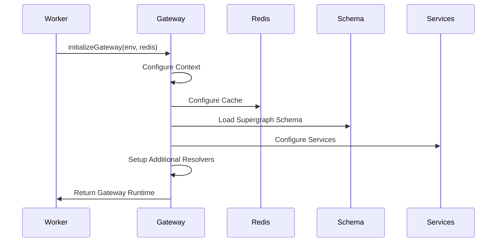

# Gateway Changes in v2

## Overview

The Gateway component in v2 has been enhanced to support Redis integration, improved performance, and better resource management. This document outlines the architectural changes and key improvements to the gateway initialization and configuration.

## Key Enhancements

- **Redis Integration**: Added support for distributed caching and state management
- **Dynamic Service Discovery**: Improved service routing based on environment
- **Memory Optimization**: Better resource allocation and disposal
- **Schema Management**: Enhanced supergraph schema handling
- **Error Propagation**: Improved error bubbling from services

## Gateway Architecture



## Gateway Initialization

The gateway initialization process has been updated to include Redis configuration:



## Key Configuration Changes

- **Redis Client**: Gateway now accepts a Redis client for distributed caching
- **Environment-Based Configuration**: Service URLs and behavior change based on environment
- **Resource Management**: Improved async disposal pattern
- **Context Propagation**: Enhanced context passing between gateway and services

## Gateway Configuration Example

```typescript
// Simplified example of gateway configuration
const gateway = initializeGateway(env, redis);

// Configuration includes:
// - Schema loading from environment
// - Redis cache integration
// - Service endpoint determination
// - Additional resolvers setup
// - Authentication configuration
```

## Best Practices

1. **Cache Sensitive Operations**: Use Redis for caching token versioning
2. **Resource Disposal**: Always implement proper resource cleanup
3. **Environment Configuration**: Use environment variables for service discovery
4. **Error Handling**: Implement consistent error propagation
5. **Monitoring**: Add metrics for gateway performance tracking
