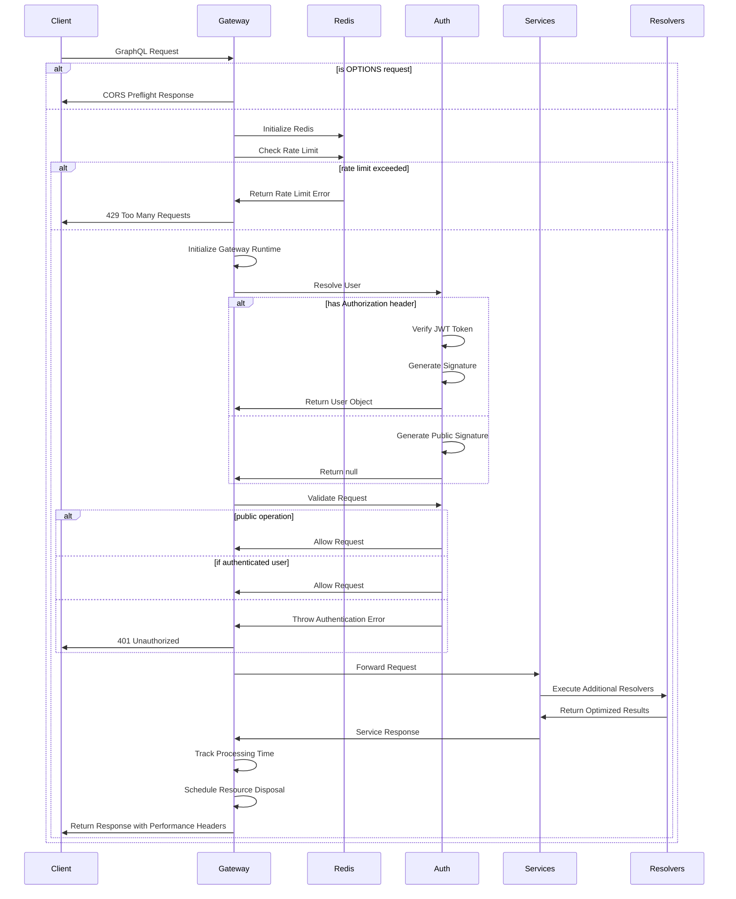

# GraphQL Gateway v2 Implementation Documentation

## Overview

This document describes the architecture and implementation details of our updated modular GraphQL gateway (version 2). The gateway serves as a unified entry point for GraphQL operations, handling authentication, request routing, rate limiting, and resource management with improved performance and reliability features.

## Key Enhancements in Version 2

- **Rate Limiting**: Added rate limiting with penalty-based blocking to protect resources
- **Performance Metrics**: Added processing time tracking and response headers
- **Redis Integration**: Incorporated Redis for distributed state management
- **Enhanced Error Handling**: Improved error handling with environment-specific responses
- **Nested Resolvers**: Added support for additional resolvers to optimize complex queries

## Architecture Components

The gateway is designed with improved modularity, separating concerns into several refined components:

- [Worker Changes](./worker-changes.md): Main entry point handling request lifecycle and environment management
- [Gateway Changes](./gateway-changes.md): Core gateway configuration and initialization
- [Authentication Changes](./auth-changes.md): Enhanced user resolution and request validation
- [Nested Resolvers](./nested-resolvers.md): New additional resolvers for optimizing complex query execution

## Request Flow

For detailed information on specific components, please refer to the linked documents.
