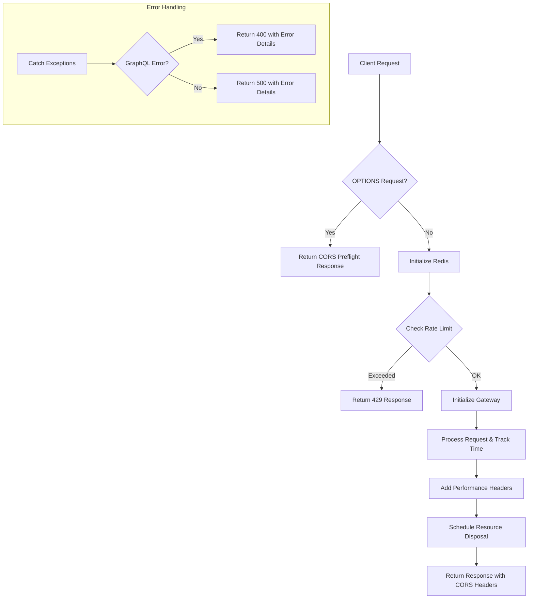
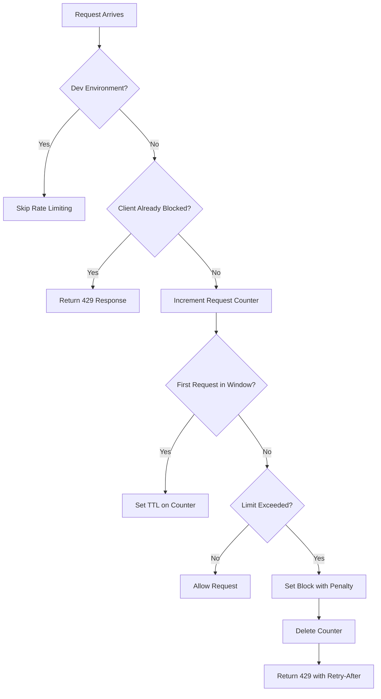
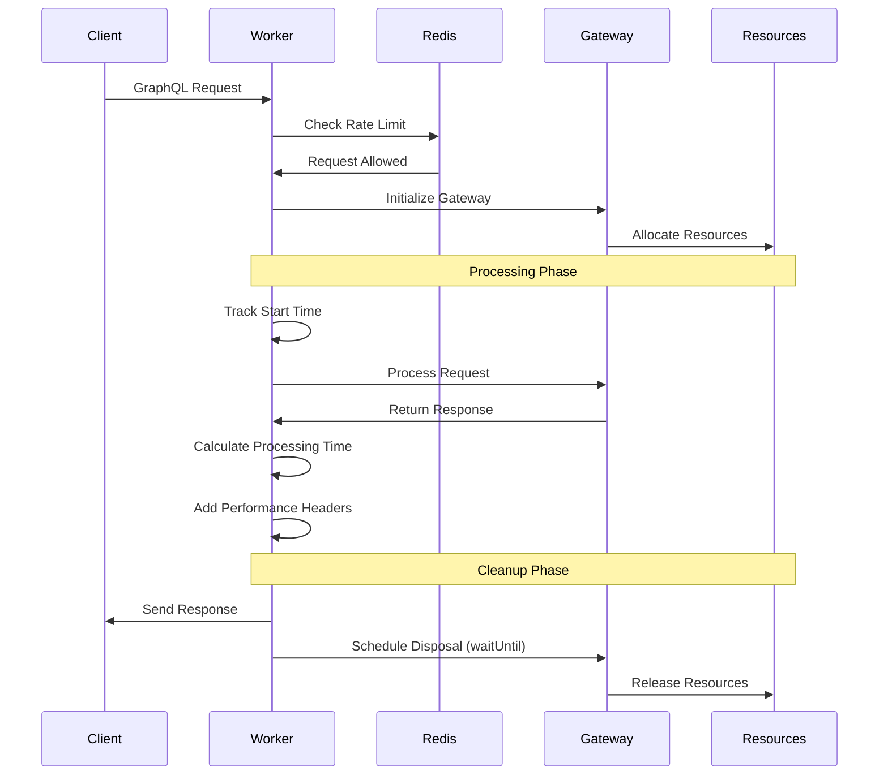

# Worker Changes in Gateway v2

## Overview

The Worker component in Gateway v2 handles the main request lifecycle, including CORS handling, rate limiting, gateway initialization, request processing, and error management. This document outlines the high-level improvements and architectural changes made to the Worker component.

## Key Enhancements

- **Environment-aware execution**: Different behavior in development vs. production
- **Redis integration**: Added distributed state management for better scalability
- **Rate limiting**: Implemented protection against API abuse
- **Performance metrics**: Added processing time tracking with response headers
- **Enhanced error handling**: Improved error reporting with environment-specific details

## Worker Request Flow

## Rate Limiting Implementation

The gateway now implements a sophisticated rate limiting system with Redis:

### Rate Limiting Configuration

- **Window**: 60 seconds tracking period
- **Request Limit**: 50 requests per window
- **Penalty**: Additional 40-second block when limit is exceeded
- **Client Identification**: Uses IP addresses and forwarding headers
- **Environment Awareness**: Disabled in development mode

## Request Processing Improvements

## Error Handling

Errors are now categorized and handled differently based on their type:

- **GraphQL Errors**: Returned with 400 status code and detailed information
- **System Errors**: Returned with 500 status code
- **Environment-Specific Details**: Stack traces only in development environment
- **Consistent Format**: All errors follow a standardized JSON structure

## Performance Metrics

The gateway now tracks and reports performance metrics:

- `X-Processing-Time` header shows request processing duration in milliseconds
- Detailed logs for performance tracking and troubleshooting

## Best Practices

1. **Early returns**: Fast paths for CORS and rate limiting
2. **Proper resource management**: Non-blocking disposal after request handling
3. **Graceful degradation**: Rate limiting failures don't block legitimate traffic
4. **Structured logging**: Consistent logging format with appropriate levels
