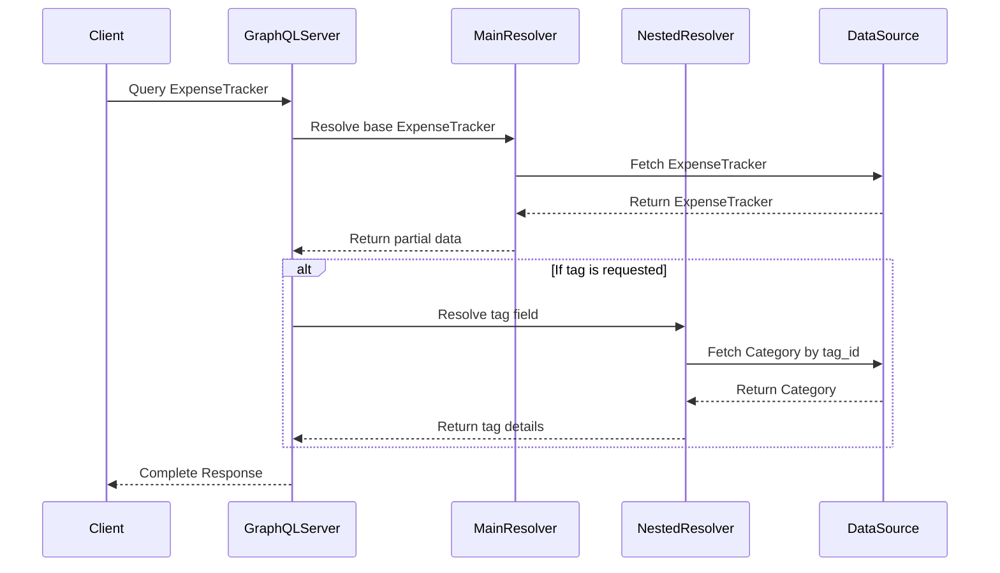

# GraphQL Nested Resolvers: Deep Dive

## Overview

Nested resolvers are a powerful feature in GraphQL that allow you to dynamically resolve complex, interconnected data types with fine-grained control and flexibility.

## Resolver Flow Diagram



## Key Concepts

### 1. What are Nested Resolvers?

Nested resolvers are functions that resolve individual fields of a complex GraphQL type. They allow you to:

- Fetch related data on-demand
- Add custom logic to field resolution
- Optimize data retrieval

### 2. Basic Structure

```typescript
const resolvers = {
  // Main query resolver
  Query: {
    expenseTrackerById: async (_, args, context) => {
      // Fetch base expense tracker
      return expenseTrackerService.getById(args.id);
    },
  },

  // Nested resolvers
  ExpenseTracker: {
    // Resolve 'tag' field
    tag: async (parent, _, { categoryService }) => {
      return categoryService.getById(parent.tag_id);
    },

    // Computed field example
    totalAmount: (parent) => {
      return parent.amount + parent.additionalCosts;
    },
  },
};
```

### 3. Benefits

- **Lazy Loading**: Fetch related data only when requested
- **Performance Optimization**: Control data retrieval granularity
- **Flexibility**: Add complex logic to field resolution

### 4. Common Patterns

#### Batch Loading

```typescript
const resolvers = {
  ExpenseTracker: {
    tag: async (parent, _, { dataloaders }) => {
      // Batch and cache category fetches
      return dataloaders.categoryLoader.load(parent.tag_id);
    },
  },
};
```

#### Error Handling

```typescript
const resolvers = {
  ExpenseTracker: {
    tag: async (parent, _, { categoryService }) => {
      try {
        return await categoryService.getById(parent.tag_id);
      } catch (error) {
        // Graceful error handling
        return null;
      }
    },
  },
};
```

## Best Practices

1. **Minimize Database Queries**

   - Use dataloader for batching
   - Implement caching strategies

2. **Handle Potential Errors**

   - Implement robust error handling
   - Provide meaningful error messages

3. **Keep Resolvers Lean**
   - Delegate complex logic to service layers
   - Focus on data resolution

## Performance Considerations

- Watch out for N+1 query problem
- Use batch loading techniques
- Implement caching mechanisms

## Example GraphQL Query

```graphql
query {
  expenseTrackerById(id: "123") {
    id
    amount
    # Only fetches related tag
    tag {
      name
      id
    }
  }
}
```

## Recommended Libraries

- **DataLoader**: Batch and cache data fetching
- **Apollo Server**: Robust GraphQL implementation
- **graphql-tools**: Advanced resolver composition

## Potential Pitfalls

- Performance overhead
- Increased complexity
- Potential for over-fetching

## Conclusion

Nested resolvers provide a powerful, flexible approach to data fetching in GraphQL, enabling sophisticated, performant data resolution strategies.
