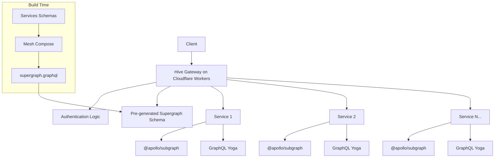
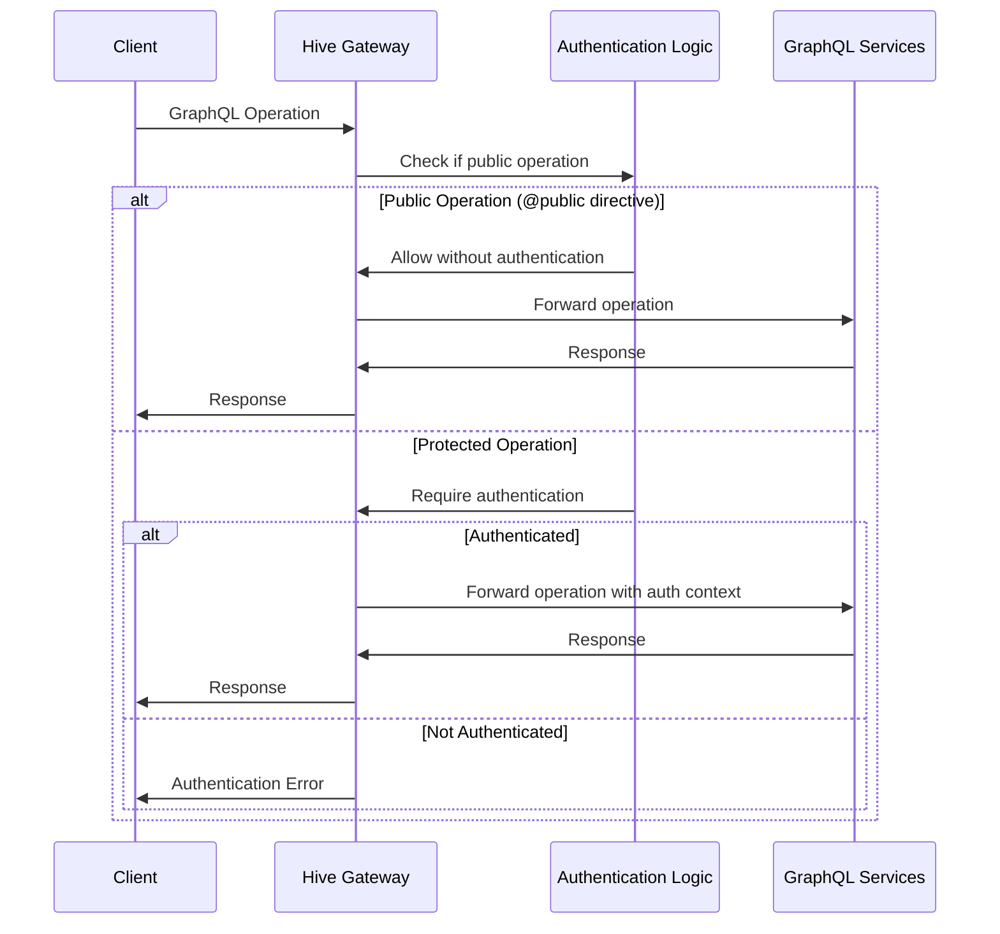
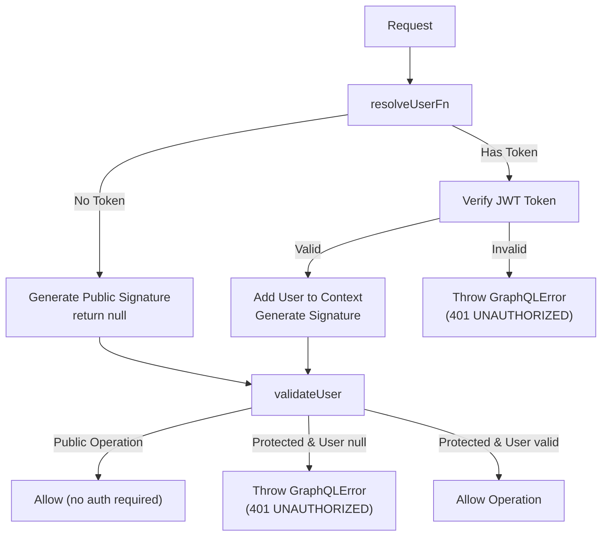
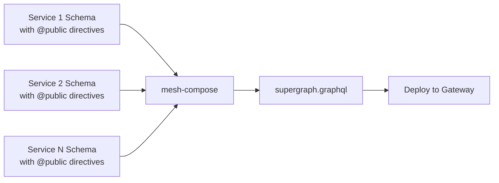
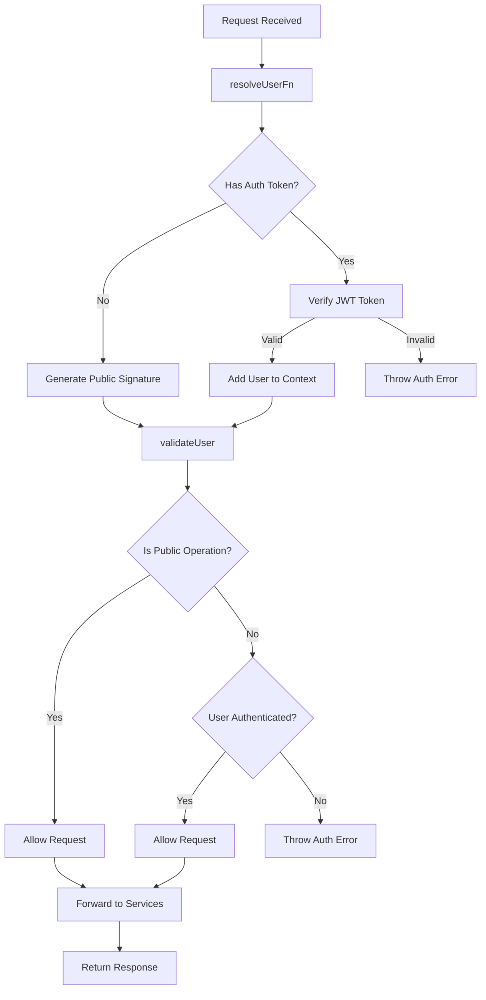
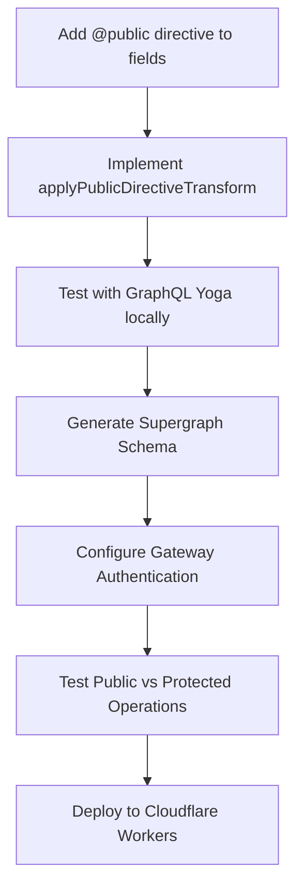

# GraphQL Authentication Implementation Documentation

## Overview

This document explains our GraphQL architecture using GraphQL Yoga with Apollo Federation in a Cloudflare Workers environment, with a focus on the authentication implementation using the `@public` directive.

## Architecture



## Authentication Flow



## Implementation Details

### 1. The `@public` Directive

The `@public` directive is used to mark certain GraphQL fields as publicly accessible without authentication. This directive is placed on field definitions in the GraphQL schema and indicates that these fields can be queried without authentication.

```graphql
directive @public on FIELD_DEFINITION
```

### 2. Authentication Logic Implementation

We use a custom authentication checker to determine if an operation accesses only fields with the `@public` directive.

The implementation follows these steps:

- Extract the document, schema, and operation name from execution arguments
- Find the operation definition within the document
- Determine the root type based on the operation type (query, mutation)
- Recursively check if the requested fields have the @public directive
- Return true if the operation only accesses public fields, false otherwise

```typescript
// Example of the isPublicOperation function
export function isPublicOperation(executionArgs: ExecutionArgs): boolean {
  try {
    const { document, schema, operationName } = executionArgs;

    if (!document || !schema) {
      return false;
    }

    // Find the operation definition
    const operation = findOperationDefinition(document, operationName);
    if (!operation?.selectionSet?.selections) {
      return false;
    }

    // Get root type based on operation type
    const rootType = getRootType(schema, operation);
    if (!rootType) {
      return false;
    }

    // Check if any field has the @public directive
    return hasPublicField(operation.selectionSet.selections, rootType);
  } catch (error) {
    console.error("Error checking for @public directive:", error);
    return false;
  }
}
```

### 3. Gateway Implementation

The gateway uses the Hive Gateway runtime with granular protection for authentication.

This implementation:

- Initializes Redis for auth token versioning.
- Creates authentication functions for user resolution and validation
- Configures the gateway with protect-granular mode to selectively authenticate operations
- Sets up the service router for forwarding requests to the appropriate services
- Includes error handling for gateway initialization failures

### 4. Authentication Functions

The gateway uses two main authentication functions:



#### Key authentication functions:

The resolver function processes the incoming request by:

- Generating a timestamp and nonce for security purposes
- Checking for an Authorization header
- For unauthenticated requests, generating a public operation signature
- For authenticated requests, verifying the JWT token and extracting user information
- Adding signature and user data to the context for downstream services

The validator function determines if the request should proceed by:

- Checking if the operation is public using the @public directive
- Allowing public operations to proceed without authentication
- For protected operations, ensuring the user is authenticated
- Throwing an error for protected operations without valid authentication

```typescript
// Example of authentication functions (simplified)
const resolveUserFn: ResolveUserFn<User> = async (context: any) => {
  return user;
};

const validateUser: ValidateUserFn<any> = ({ user, executionArgs }) => {
  // Check if operation is public using the @public directive
  if (isPublicOperation(executionArgs)) {
    return; // Allow public operations
  }

  // For non-public operations, validate authentication
  if (user === null) {
    throw new GraphQLError("Authentication failed for non-public operation", {
      extensions: { code: "UNAUTHORIZED", status: 401 },
    });
  }
};
```

## Service Implementation

Each service uses GraphQL Yoga with @apollo/subgraph and applies the @public directive transformation

The implementation:

- Preserves special federation fields like **resolveReference and **resolveType
- Sanitizes resolver maps to ensure compatibility with federation
- Uses buildSubgraphSchema to create federation-ready schemas
- Applies the public directive transformation to properly handle the @public directive
- Processes both mutation and query fields for public access

```typescript
// Import required dependencies
import { typeDefs } from "../types";
import { resolvers as originalResolvers } from "../resolvers";
import { buildSubgraphSchema } from "@apollo/subgraph";
import { GraphQLResolverMap } from "@apollo/subgraph/dist/schema-helper";
import applyPublicDirectiveTransform from "./applyPublicDirectiveTransform";

// Create a type-safe version of the resolvers that preserves federation fields
const sanitizeResolvers = (resolvers: any): GraphQLResolverMap => {
  const result: GraphQLResolverMap = {};

  // List of special federation fields we want to keep
  const federationFields = ["__resolveReference", "__resolveType"];

  for (const typeName in resolvers) {
    result[typeName] = {};

    for (const fieldName in resolvers[typeName]) {
      const shouldKeepField =
        federationFields.includes(fieldName) || // Keep federation fields
        !fieldName.startsWith("__"); // Keep regular fields

      if (shouldKeepField) {
        result[typeName][fieldName] = resolvers[typeName][fieldName];
      }
      // Fields not matching either condition are skipped
    }
  }

  return result;
};

// Use the sanitized resolvers with federation fields preserved
const sanitizedResolvers = sanitizeResolvers(originalResolvers);

// Build the federation schema
export const schema = applyPublicDirectiveTransform(
  buildSubgraphSchema({
    typeDefs,
    resolvers: sanitizedResolvers,
  }),
);
```

### Transform Function Implementation

```typescript
function applyPublicDirectiveTransform(schema: GraphQLSchema): GraphQLSchema {
  return mapSchema(schema, {
    [MapperKind.MUTATION_ROOT_FIELD]: (fieldConfig) => {
      const publicDirective = getDirective(schema, fieldConfig, "public")?.[0];
      if (publicDirective) {
        return fieldConfig;
      }
    },
    [MapperKind.QUERY_ROOT_FIELD]: (fieldConfig) => {
      const publicDirective = getDirective(schema, fieldConfig, "public")?.[0];
      if (publicDirective) {
        return fieldConfig;
      }
    },
  });
}
```

## Schema Generation

We use Mesh v1 with mesh-compose to generate the supergraph schema file ahead of time, not at runtime:



## Gateway Authentication Process



## Considerations

### Performance

GraphQL Yoga offers better performance in edge serverless environments like Cloudflare Workers compared to Apollo Server due to:

- Smaller bundle size
- Optimized for serverless execution
- Reduced cold start times

### Handling the @public Directive

The implementation ensures that:

1. Services define the @public directive on their schema fields
2. The applyPublicDirectiveTransform function processes these directives at the service level
3. The gateway checks for public operations using the isPublicOperation function
4. Authentication logic bypasses token requirements for operations that only access public fields

## Troubleshooting

### Common Issues

1. **Directive not propagating to supergraph**

   - Solution: Ensure the directive is properly defined in all service schemas
   - Check if applyPublicDirectiveTransform is properly implemented

2. **Authentication failures for public operations**

   - Verify the isPublicOperation function is correctly identifying public fields
   - Check directive application in the schema generation process

3. **JWT verification failures**
   - Check JWT_SECRET environment variable
   - Verify token format and expiration

## Development Workflow


