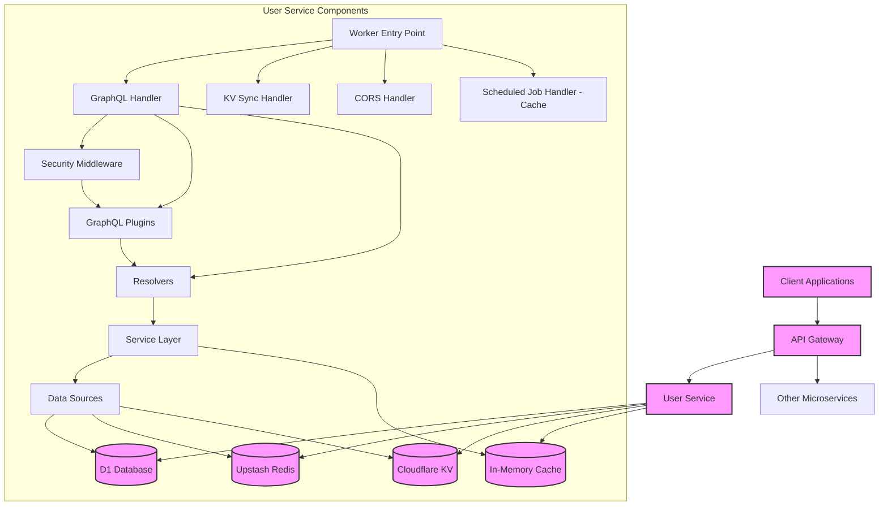
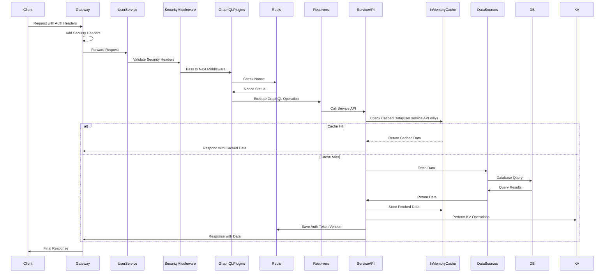
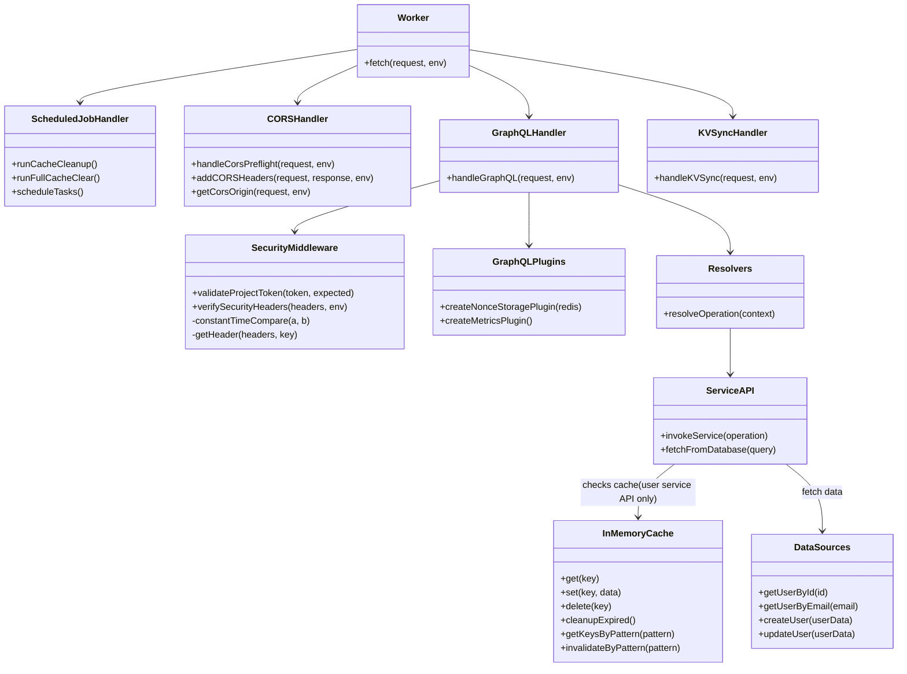
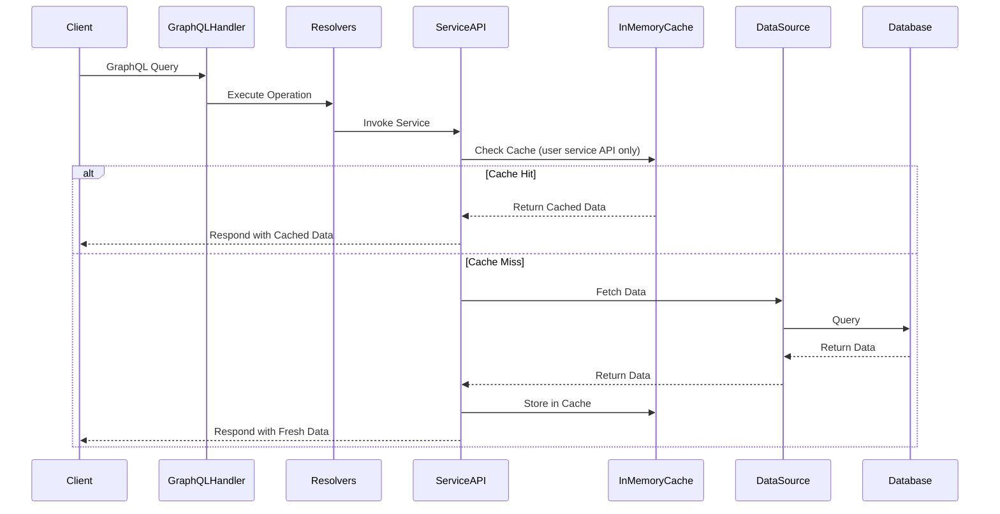
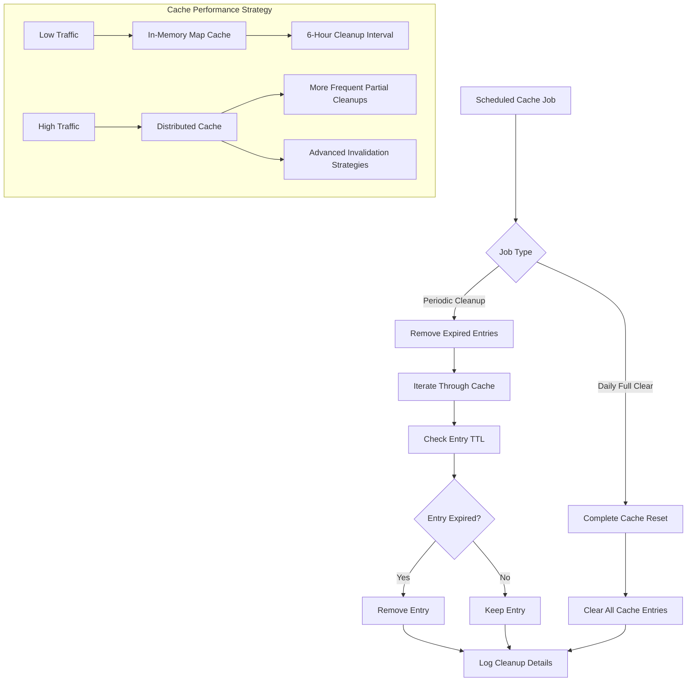
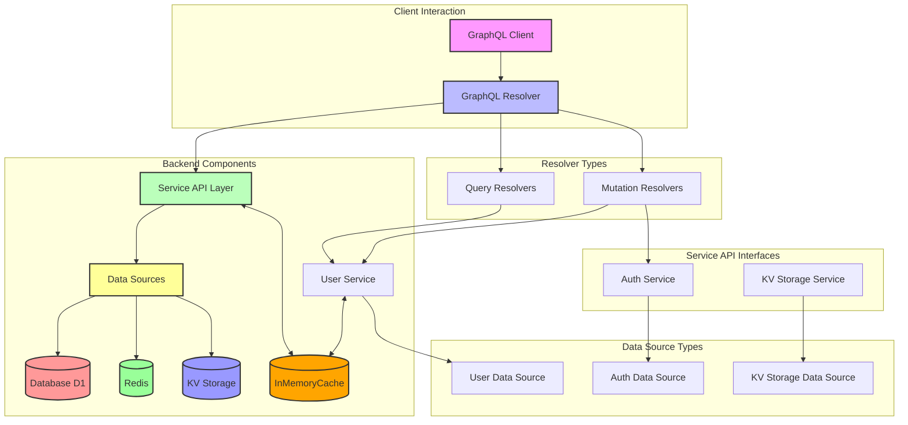
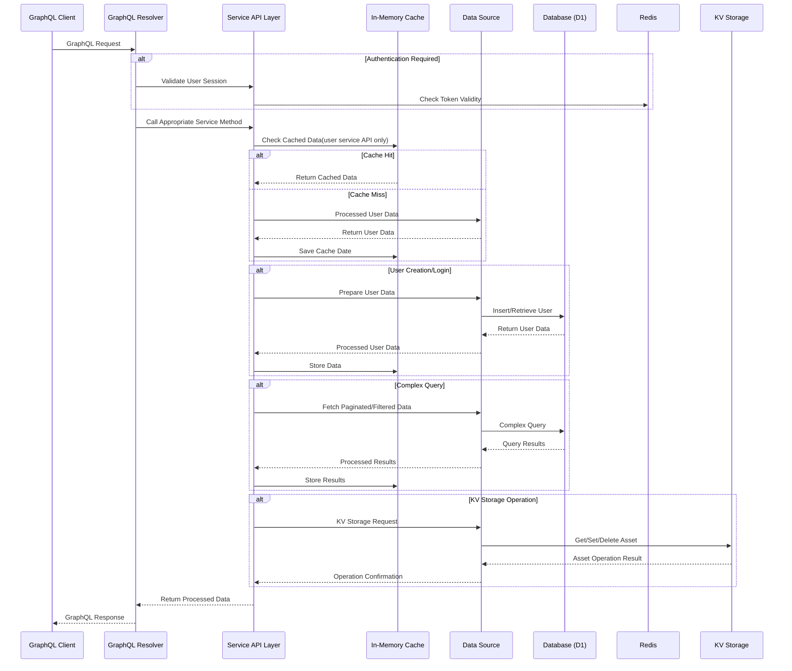
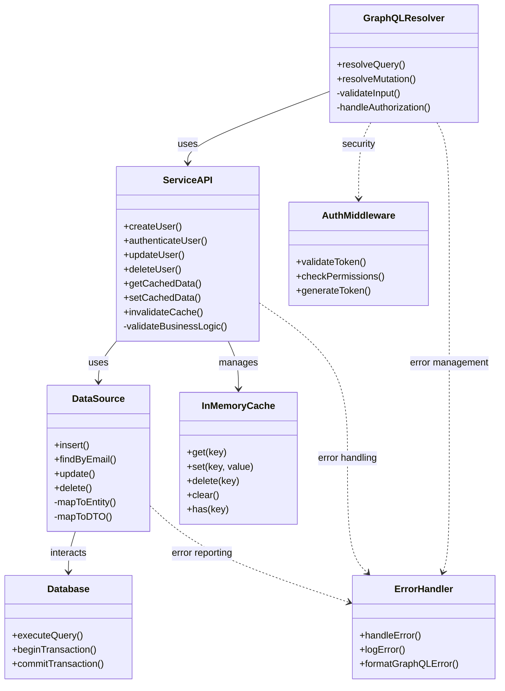

# User Service Technical Design Document

## Overview

The User Service is a microservice in our architecture that provides user management functionality through a GraphQL API. It's built as a Cloudflare Worker with D1 database integration and implements security mechanisms to ensure secure API access.

## Table of Contents

- [Technical Stack](#technical-stack)
- [Architecture Overview](#architecture-overview)
- [Development Setup](#development-setup)
- [API Endpoints](#api-endpoints)
- [Authentication & Security](#authentication--security)
- [Core Components](#core-components)
- [Request Flow](#request-flow)
- [Directory Structure](#directory-structure)
- [DB Structure](#db-structure)
- [Error Handling](#error-handling)
- [Testing](#testing)
- [Deployment and CI/CD](#deployment-and-cicd)
- [Conclusion](#conclusion)

## Technical Stack

- **Cloudflare Workers**: Serverless compute platform
- **Languages**: Typescript, GraphQL
- **Frameworks**: NodeJS, Graphql Yoga
- **D1 Database**: Cloudflare's SQL database
- **KV Namespace**: Cloudflare's KV namespaces(key-value database)
- **GraphQL (Yoga)**: API query language and runtime
- **Drizzle ORM**: Database toolkit for TypeScript
- **Upstash Redis**: Distributed Redis for auth token versioning and nonce tracking
- **Hosting**: Cloud-based hosting environment

### External Values

N/A

### Required Headers

- `X-Project-Token` , `X-Gateway-Nonce`, `X-Gateway-Signature`, `X-Gateway-Timestamp`, `X-User-Id`, `X-User-Role`, `X-User-Email`, `X-User-Name`

### Interfaces

- Graphql Mesh with hive gateway interface

**Purpose:** Server as primary interface to interact with user service.

- **API**: GraphQL
- **Protocols Used**: GraphQL over HTTPS
- **Other Interface**: Callable from other cloudflare workers by service binding.

## Architecture Overview

### System Architecture



### Request Flow Diagram



## Development Setup

### Prerequisites

- Wrangler CLI installed
- Access to Cloudflare account with appropriate permissions
- Node.js and npm/yarn

### Installation

1. Clone the repository
2. Install dependencies: `bun install`
3. Set up environment variables (see below)

### Environment Variables

Required environment variables:

- `ENVIRONMENT`: Environment mode (DEV, STAGING, PROD)
- `PROJECT_TOKEN`: API access token
- `JWT_SECRET`: Secret for JWT operations
- `GATEWAY_SECRET`: Secret for gateway signature validation
- `GATEWAY_SIGNATURE`: Signature for schema federation
- `ALLOWED_ORIGINS`: Comma-separated list of allowed CORS origins
- `NONCE_ENABLED`: Enable/disable nonce validation ("true"/"false")
- `KV_SYNC_TOKEN`: Token for KV sync operations

### Available Scripts

```json
"scripts": {
  "migrate": "./migrate.sh",
  "generate": "graphql-codegen",
  "migration-list": "wrangler d1 migrations list DB",
  "migration-apply-production": "wrangler d1 migrations apply DB --remote",
  "deploy:staging": "wrangler deploy --env staging",
  "bundle-size": "wrangler build && wrangler deploy --dry-run",
  "deploy": "wrangler deploy",
  "dev": "(kill -9 $(lsof -t -i:8501) || true) && wrangler dev --name user-hub --port 8501 --inspector-port 8301 --persist-to=.db-local",
  "test": "vitest",
  "cf-typegen": "wrangler types",
  "prod:secrets": "./wrangler-secrets.sh"
}
```

### Local Development Workflow


## API Endpoints

### GraphQL Endpoint: `/graphql`

The main interface for interacting with user data. Provides queries and mutations for user management operations.

#### Example GraphQL Operations

```graphql
# Query user information
query AllUsers($id: ID!) {
  users(id: $id) {
    __typename
    id
    name
    email
    role
  }
}

# Create a new user
mutation signUp($input: SignUpInput!) {
  signUp(input: $input) {
    success
    user {
      __typename
      email
      id
      name
      role
    }
  }
}
```

### KV Sync Endpoint: `/kv-site-assets`

Reserved for internal use to synchronize KV storage. Requires authentication via `KV_SYNC_TOKEN`.

## Authentication & Security

The service implements several security mechanisms:

### Security Flow


### 1. Project Token Validation

All requests must include a valid `X-Project-Token` header that matches the configured `PROJECT_TOKEN`.

### 2. Gateway Security Headers

The following headers are required for authenticated requests:

- `X-Gateway-Timestamp`: Current timestamp
- `X-Gateway-Nonce`: Unique request identifier
- `X-Gateway-Signature`: HMAC-SHA256 signature of payload
- `X-User-Id`, `X-User-Role`, `X-User-Email`, `X-User-Name`: User context headers

### 3. Nonce Validation

To prevent replay attacks, each nonce can only be used once within a 5-minute window.


### 4. Session User

The service extracts user context from headers to create a session:

```typescript
type SessionUserType = {
  id: string;
  role: Role; // ADMIN or USER
  email: string;
  name: string;
} | null;
```

### 5. CORS Protection

Implements strict CORS protection with origin validation against the `ALLOWED_ORIGINS` environment variable.


## Core Components

### Main Worker Handler

Entry point for all requests, routing to appropriate handlers based on URL paths.

```typescript
export default {
  async fetch(request: Request, env: Env): Promise<Response> {
    // Request routing logic
    // ...
  },
} as ExportedHandler<Env>;
```

### In-Memory Cache

We've implemented an in-memory caching mechanism to improve performance and reduce database load for frequently accessed user data. The `InMemoryCache` class provides a flexible caching solution with the following key features:

- Configurable Time-to-Live (TTL)
- Automatic cache entry expiration
- Pattern-based key invalidation
- Thread-safe operations using JavaScript's `Map`

#### Cache Implementation Details

```typescript
export class InMemoryCache<T> {
  private readonly cache: Map<string, CacheEntry<T>>;
  private readonly ttl: number;

  constructor(ttlInSeconds = 300) {
    this.cache = new Map();
    this.ttl = ttlInSeconds * 1000; // Convert to milliseconds
  }

  // Methods: get, set, delete, clear,
  // getKeysByPattern, invalidateByPattern, cleanupExpired
}

// Dedicated cache instance for user-related data
export const userCache = new InMemoryCache(15 * 60); // 15 minutes TTL
```

### Component Interaction



#### Caching Workflow



### Caching Strategy

- **Current Stage**: Using JavaScript's native `Map` for low-traffic scenarios
- **Traffic Handling**:
  - Low Traffic: In-memory cache with `Map`
  - High Traffic: Planned migration to distributed Redis cache

### Considerations and Future Improvements

1. **Performance Monitoring**: Implement cache hit/miss tracking
2. **Cache Invalidation**: Robust strategies for updating cached data
3. **Scalability**: Prepare for migration to distributed caching
4. **Memory Management**: Implement periodic cache cleanup

## Scheduled Jobs and Cache Management

### Cron Job Configuration

The User Service implements scheduled cache management jobs to ensure efficient memory usage and data freshness:

```json
"triggers": {
  "crons": [
    "0 */6 * * *",  // Cache cleanup - expired entries - every 6 hours
    "0 1 * * *"     // Full cache clear - daily at 1 AM
  ]
}
```

### Cache Cleanup Implementation

## Scheduled Job Handler

```typescript
async scheduled(controller: ScheduledController, env: Env, ctx: ExecutionContext) {
  switch (controller.cron) {
    case "0 */6 * * *":
      await runCacheCleanup(env, ctx);
      break;
    case "0 1 * * *":
      await runCleanCacheAll(env, ctx);
      break;
    default:
      console.error(`Unsupported cron schedule: ${controller.cron}`);
  }
}
```

### Cache Cleanup Strategy

#### Periodic Expired Entry Removal (Every 6 Hours)

- Removes entries that have exceeded their Time-to-Live (TTL)
- Helps prevent memory bloat
- Ensures cache contains only valid, recent data

#### Daily Full Cache Clear (1 AM Daily)

- Completely clears the cache
- Provides a comprehensive reset mechanism
- Useful for preventing potential long-term memory accumulation

### Caching Considerations



### Performance and Scalability Notes

1. **Current Implementation**:

   - Uses JavaScript's native `Map`
   - Suitable for low-traffic scenarios
   - Cleanup interval of 6 hours

2. **Future Scalability Considerations**:
   - Monitor cache performance
   - Potential migration to Redis for distributed caching
   - Adjust cleanup intervals based on traffic patterns
   - Implement more sophisticated cache invalidation strategies

### Recommended Cleanup Interval Guidelines

- **Low Traffic**: 6-hour cleanup interval
- **Moderate Traffic**: 30-minute cleanup interval
- **High Traffic**:
  - More frequent partial cleanups
  - Consider distributed caching solutions

### Monitoring and Logging

- Console logs track cache cleanup operations
- Future improvements may include:
  - Detailed cache performance metrics
  - Automated alerts for cache-related issues
  - Comprehensive logging of cache operations

### GraphQL Handler (`handlers/graphql.ts`)

Manages GraphQL request processing, context setup, and security validation.

### KV Sync Handler (`handlers/kv-sync.ts`)

Handles KV storage synchronization for authentication configuration.

### Security Middleware (`security-middleware.ts`)

Implements security validation logic including:

- Project token validation
- Signature verification
- Timestamp validation
- Nonce management

### GraphQL Plugins (`graphql-plugins.ts`)

Custom plugins for GraphQL processing:

- `createNonceStoragePlugin`: Manages nonce validation and storage
- `createMetricsPlugin`: Tracks and logs execution metrics

### CORS Management (`cors-headers.ts`)

Handles Cross-Origin Resource Sharing (CORS) headers and preflight requests.

## Request Flow

1. **Request Received**: Worker receives HTTP request
2. **CORS Preflight Check**: If OPTIONS request, handle CORS preflight
3. **Route Determination**: Based on URL path
   - `/graphql` → GraphQL processing
   - `/kv-site-assets` → KV synchronization
   - Other paths → 404 response
4. **Security Validation**:
   - Project token verification
   - Gateway headers validation
   - Timestamp and signature checks
5. **Context Creation**: Build GraphQL context with:
   - User session information
   - Service APIs
   - Security context
6. **Request Processing**: Execute GraphQL operation or KV sync
7. **Response Generation**: Format response with appropriate CORS headers

## Directory Structure (src/directory)

```
├── handlers/
│   ├── graphql.ts             # GraphQL request handler
│   ├── kv-sync.ts             # KV synchronization handler
│   ├── security-middleware.ts # Security validation middleware
│   └── graphql-plugins.ts     # GraphQL plugins for nonce and metrics
├── services/
│   ├── helper                 # Helper file for jwt, validator
│   ├── index.ts               # Service exports
│   ├── auth-service.ts        # Authentication services
│   ├── user-service.ts        # User management services
│   └── kv-storage-service.ts  # KV storage services
├── schemas/
│   └── index.ts               # Schema exports
├── datasources/
│   ├── auth.ts                # Authentication data access
│   ├── user.ts                # User data access
│   ├── kv-storage.ts          # KV access
│   └── utils.ts
├── resolvers/
│   ├── index.ts               # Resolver exports
│   └── mutations              # User mutation
│        └──index.ts
│   └── queries                # User query
│        └──index.ts
├── types/
│   └── index.ts               # Type exports(graphql schema)
├── cors-headers.ts            # CORS handling utilities
├── index.ts                   # Main worker entry point
```

## DB Structure

**user**

| Field      | Types   | Constraint       | Format   |
| ---------- | ------- | ---------------- | -------- |
| id         | TEXT    | PK, NOT NULL     |          |
| name       | TEXT    | NOT NULL         |          |
| email      | TEXT    | UNIQUE, NOT NULL |          |
| password   | TEXT    | NOT NULL         |          |
| role       | TEXT    | NOT NULL         |          |
| phone      | TEXT    | UNIQUE, NOT NULL |          |
| address    | TEXT    | Nullable         |          |
| city       | TEXT    | Nullable         |          |
| state      | TEXT    | Nullable         |          |
| country    | TEXT    | Nullable         |          |
| zipcode    | TEXT    | Nullable         |          |
| created_at | INTEGER | NOT NULL         | DateTime |
| updated_at | INTEGER | NOT NULL         | DateTime |
| created_by | TEXT    | NOT NULL         |          |
| updated_by | TEXT    | NOT NULL         |          |

**Indexes**

- `idx_email` on **email**
- `idx_phone` on **phone**
- `composite_email_phone` (Unique) on **email** and **phone**


## GraphQL Schema, Resolvers, Service API Interfaces and Data Sources

### GraphQL Schema (Types)

```GraphQL
directive @public on FIELD_DEFINITION

scalar DateTime
scalar JSON

# ADMIN, MODERATOR, USER
enum Role {
  ADMIN
  USER
}

enum Sort {
  ASC
  DESC
}

enum SORT_BY {
  CREATED_AT
  UPDATED_AT
}

type User {
  id: ID! # nano_id
  name: String!
  email: String!
  password: String! # hashed
  role: Role!
  phone: String!
  address: String
  city: String
  state: String
  country: String
  zipcode: String
  created_at: DateTime!
  updated_at: DateTime!
  created_by: String!
  updated_by: String!
}

input SignUpInput {
  name: String!
  email: String!
  password: String!
  phone: String!
  role: Role
  address: String
  city: String
  state: String
  country: String
  zipcode: String
}

type SignUpResponse {
  success: Boolean!
  user: UserSuccessResponse
}

input LoginInput {
  email: String!
  password: String!
}

type LoginResponse {
  success: Boolean!
  token: String
  user: UserSuccessResponse
}

type UserSuccessResponse {
  id: ID!
  name: String!
  email: String!
  phone: String!
  role: Role!
  address: String
  city: String
  state: String
  country: String
  zipcode: String
}

type UserResponse {
  id: ID!
  name: String!
  email: String!
  role: Role!
  phone: String!
  address: String
  city: String
  state: String
  country: String
  zipcode: String
  created_at: DateTime!
  updated_at: DateTime!
  created_by: String!
  updated_by: String!
}

input UserByEmailInput {
  email: String!
}

input UserByFieldInput {
  field: ColumnName!
  value: String!
}

input DeleteUserInput {
  id: ID!
}

input EditUserInput {
  id: ID!
  name: String!
  email: String!
  phone: String!
  role: Role
  address: String
  city: String
  state: String
  country: String
  zipcode: String
}

type EditUserResponse {
  success: Boolean!
  user: UserSuccessResponse
}

input ChangePasswordInput {
  id: ID!
  current_password: String!
  new_password: String!
  confirm_password: String!
}

enum ColumnName {
  id
  name
  email
  phone
  role
  address
  city
  state
  country
  zipcode
}

type LogoutResponse {
  success: Boolean!
}

type AdminKvAsset {
  kv_key: String!
  kv_value: JSON
}

input AdminKvAssetInput {
  kv_key: String!
}

input PaginatedUsersInputs {
  first: Int = 10
  after: String
  sort: Sort = DESC
  sort_by: SORT_BY = CREATED_AT
}

type UserEdge {
  node: User!
  cursor: String!
}

type PageInfo {
  endCursor: String
  hasNextPage: Boolean!
}

type UsersConnection {
  edges: [UserEdge!]!
  pageInfo: PageInfo!
}

type Query {
  userByEmail(input: UserByEmailInput!): UserResponse
  userByfield(input: UserByFieldInput!): [UserResponse]
  users: [UserResponse]
  paginatedUsers(ids: [ID!], input: PaginatedUsersInputs): UsersConnection
  adminKvAsset(input: AdminKvAssetInput!): AdminKvAsset
}

type Mutation {
  signUp(input: SignUpInput!): SignUpResponse! @public
  login(input: LoginInput!): LoginResponse! @public
  editUser(input: EditUserInput!): EditUserResponse!
  deleteUser(input: DeleteUserInput!): Boolean!
  changePassword(input: ChangePasswordInput!): Boolean!
  logout: LogoutResponse!
}
```

### Resolvers (Query/Mutation)

The resolvers implement the GraphQL schema operations, translating client requests into service layer method calls. They are responsible for:

- Validating input
- Calling appropriate service methods
- Formatting and returning responses
- Handling authorization and access control

### Service API Interfaces

The service layer provides business logic implementation between resolvers and data sources

- User Service API
- Auth Service API
- KV Storage Service API

### Data Sources

The data sources layer provides an abstraction over the database access, implementing repository patterns for each entity:

- User Data Source
- Auth Data Source
- KV Storage Data Source

**Implementation Notes**

1. All methods should implement thorough input validation
2. Use dependency injection for services and data sources
3. Implement consistent error handling across all layers
4. Use transactions for critical database operations
5. Implement logging for all significant events and errors

### User Service Component Interaction Flow



### User Service Detailed Interaction Sequence



### User Service Component Relationships



## Error Handling

The service implements structured error handling with GraphQL error extensions:

```typescript
throw new GraphQLError("Error message", {
  extensions: {
    code: "ERROR_CODE",
    status: 4xx, // HTTP status code
    // Additional metadata
  }
});
```

**General Principles**

1. **Explicit Error Types**: Define custom error types that clearly describe different error conditions. This helps clients understand the nature of the error and how to respond to it.
2. **Error Codes**: Assign unique error codes to different types of errors for easy identification and localization of error messages.
3. **Consistent Structure**: Ensure that all errors returned from the API have a consistent structure, making it easier for clients to parse and handle errors.
4. **Detailed Messages**: Provide detailed error messages that offer insights into why an operation failed. This can include validation failures, system errors, or execution issues.
5. **User-Friendly Language**: Error messages should be in user-friendly language, avoiding technicalities that may not be understandable to end users.

**Implementing Error Responses**

**GraphQL Error Object**: Utilize the GraphQL `errors` object to return errors. Each error can include:

1. **`message`**: A human-readable error message.
2. **`extensions`**: An optional field that can include additional details such as error codes, type of error, and other relevant information.

### Error Flow


### Common Error Codes

- `UNAUTHORIZED`: Invalid project token
- `GATEWAY_UNAUTHORIZED`: Missing security headers
- `INVALID_SIGNATURE`: Signature verification failed
- `REQUEST_TIMEOUT`: Request timestamp too old
- `REPLAY_ATTACK`: Nonce already used
- `VALIDATION_ERROR`: Input validation failed
- `NOT_FOUND`: Requested resource not found
- `FORBIDDEN`: Insufficient permissions
- `INTERNAL_SERVER_ERROR`: Unexpected server error

## Testing

- **Unit Tests**
  - Unit tests for resolver functions
- **End-to-End (E2E) Tests**
  - Complete user service workflows which includes CRUD operations should be tested.
  - Use Playwright or Selenium

## Deployment and CI/CD


## Conclusion

The above schema and other information needs to be in alliance with the conventions present in the ADRs.
